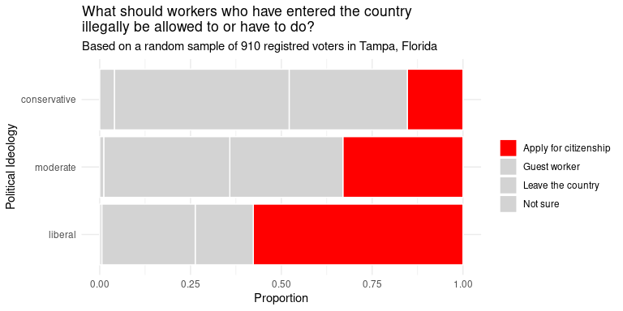

# KEY Tutorial 3: EDA with Categorical Data
KEY

- [Before You Begin](#before-you-begin)
- [EDA with Categorical Data](#eda-with-categorical-data)
- [Libraries](#libraries)
- [By the end of this tutorial I should be able
  to…](#by-the-end-of-this-tutorial-i-should-be-able-to)
- [1: Exploring One Categorical
  Variable](#1-exploring-one-categorical-variable)
  - [1.1 Data for Part One](#11-data-for-part-one)
    - [1.1: Tasks and Questions](#11-tasks-and-questions)
  - [1.2 Build a table](#12-build-a-table)
    - [1.2 Tasks and Questions](#12-tasks-and-questions)
  - [1.3 Table with Proportions and
    Counts](#13-table-with-proportions-and-counts)
    - [1.3 Tasks and Questions](#13-tasks-and-questions)
  - [1.4 Arranging the table](#14-arranging-the-table)
    - [1.4 Tasks and Questions](#14-tasks-and-questions)
  - [1.5: Build a Bar Plot](#15-build-a-bar-plot)
    - [1.5 Tasks and Questions](#15-tasks-and-questions)
  - [1.6: Adjust bar plot to implement some data visualizations best
    practices.](#16-adjust-bar-plot-to-implement-some-data-visualizations-best-practices)
    - [1.6a: Horizontal Bars and
      Labels](#16a-horizontal-bars-and-labels)
    - [1.6b: Arranging the bars and changing
      colors](#16b-arranging-the-bars-and-changing-colors)
- [2: Exploring Two Categorical
  Variables](#2-exploring-two-categorical-variables)
  - [2.1: Contingency Table with
    Counts](#21-contingency-table-with-counts)
    - [2.1: Tasks and Questions](#21-tasks-and-questions)
  - [2.2: Contingency Table with
    Proportions.](#22-contingency-table-with-proportions)
    - [2.2: Tasks and Questions](#22-tasks-and-questions)
  - [2.3: Visualize Two Categorical Variables with a Standardized Bar
    Plot](#23-visualize-two-categorical-variables-with-a-standardized-bar-plot)
    - [2.3a: Create a Standardized Bar
      Plot](#23a-create-a-standardized-bar-plot)
    - [2.3b Adjust standardized bar plot to include some data
      visualization best
      practices](#23b-adjust-standardized-bar-plot-to-include-some-data-visualization-best-practices)

# Before You Begin

Be sure to **read everything** as the structure of the tutorial is such
that everything builds upon the items that came before it.

<div style="color: black; background-color: white; padding: 15px; border: 5px solid #FF585D; border-radius: 5px;">

Any text highlighted in this red border will require you to either
**edit and run a code chunk or just run a code chunk**.

</div>

<div style="color: black; background-color: white; padding: 15px; border: 5px solid #006CB3; border-radius: 5px;">

Any text highlighted in this blue border will **require you to answer a
question**. You can type your response directly in the box with the blue
border.

</div>

# EDA with Categorical Data

# Libraries

``` r
library(tidyverse)
```

    ── Attaching core tidyverse packages ──────────────────────── tidyverse 2.0.0 ──
    ✔ dplyr     1.1.4     ✔ readr     2.1.5
    ✔ forcats   1.0.1     ✔ stringr   1.5.2
    ✔ ggplot2   4.0.0     ✔ tibble    3.3.0
    ✔ lubridate 1.9.4     ✔ tidyr     1.3.1
    ✔ purrr     1.1.0     
    ── Conflicts ────────────────────────────────────────── tidyverse_conflicts() ──
    ✖ dplyr::filter() masks stats::filter()
    ✖ dplyr::lag()    masks stats::lag()
    ℹ Use the conflicted package (<http://conflicted.r-lib.org/>) to force all conflicts to become errors

``` r
library(openintro)
```

    Loading required package: airports
    Loading required package: cherryblossom
    Loading required package: usdata

``` r
library(janitor)
```


    Attaching package: 'janitor'

    The following objects are masked from 'package:stats':

        chisq.test, fisher.test

``` r
library(knitr)
library(gridExtra)
```


    Attaching package: 'gridExtra'

    The following object is masked from 'package:dplyr':

        combine

``` r
library(readr)
library(gt)
```


    Attaching package: 'gt'

    The following object is masked from 'package:openintro':

        sp500

``` r
library(ggthemes)
```

# By the end of this tutorial I should be able to…

1: Explore one categorical variable by…

- Building a table with counts and proportions

- Arranging a table from least to greatest or greatest to least

- Building a bar plot and adjust the direction, arrangement, and color
  of the bars and change labels.

2: Explore two categorical variables by…

- Build a contingency table with counts and proportions

- Create a bar plot that includes both variables and adjusting styling
  and labels.

# 1: Exploring One Categorical Variable

## 1.1 Data for Part One

To learn how you can explore one categorical variable using R, you will
use the data in the `openintro` packaged called `immigration`.

[Click here to read a description of the
dataset.](http://openintrostat.github.io/openintro/reference/immigration.html)

### 1.1: Tasks and Questions

<div style="color: black; background-color: white; padding: 15px; border: 5px solid #006CB3; border-radius: 5px;">

1.  Without running the code below, read the code and write down what
    the name of the data frame will be. (Be sure to type the name
    EXACTLY as it appears in the code)

    immigration

</div>

<div style="color: black; background-color: white; padding: 15px; border: 5px solid #006CB3; border-radius: 5px;">

2.  What/Who are the observational units?

    The observation units are 910 randomly sampled registered voters in
    Tampa, FL.

</div>

<div style="color: black; background-color: white; padding: 15px; border: 5px solid #006CB3; border-radius: 5px;">

3.  How many observations are there? (You can now run the code to help
    answer this question.)

    There are 910 observations.

</div>

<div style="color: black; background-color: white; padding: 15px; border: 5px solid #006CB3; border-radius: 5px;">

4.  List the two variables included in this data frame. Be sure to list
    the name of the variable exactly as it appears and label the type of
    each variable.

    `response` - categorical

    `political` - categorical

</div>

``` r
# View it and take a glimpse of it.

view(immigration)

glimpse(immigration)
```

    Rows: 910
    Columns: 2
    $ response  <fct> Apply for citizenship, Apply for citizenship, Apply for citi…
    $ political <fct> conservative, conservative, conservative, conservative, cons…

## 1.2 Build a table

Now that you have an understanding of the data, let’s start exploring.

To begin, we will explore the question:

**How many of the survey respondents described themselves as having a
political ideology of either conservative, liberal, or moderate?**

Obviously, we are not going to look at the data and get our answer by
counting by hand! What a waste of time! One thing we could do is tell
the computer to build a table for us! The structure of the code required
to make a table will read like this:

Look at this data called `immigration` `AND THEN`

`count` the number of items for each level in this
`categorical variable`.

### 1.2 Tasks and Questions

<div style="color: black; background-color: white; padding: 15px; border: 5px solid #FF585D; border-radius: 5px;">

1.  Based on the description above that details the structure of the
    code, erase the `______` sections in the code chunk below and
    replace them with either the *name of the data set* or *the name of
    the variable* needed to answer our question.

</div>

<div style="color: black; background-color: white; padding: 15px; border: 5px solid #006CB3; border-radius: 5px;">

2.  Which political ideology had the most respondents? How many did they
    have?

</div>

``` r
immigration |>
  count(political)
```

    # A tibble: 3 × 2
      political        n
      <fct>        <int>
    1 conservative   372
    2 liberal        175
    3 moderate       363

## 1.3 Table with Proportions and Counts

Knowing the total in each group is helpful. Knowing what proportion of
respondents fell into each level can also be helpful. To get that
information you have to add one line of code to what you wrote in part
1.2.

That line of code is what you see in the gray space below. The
**`mutate`** function in that line **is creating a new variable called**
proportion that takes the number of respondents in each level and
divides each of those by the total number of respondents.

### 1.3 Tasks and Questions

<div style="color: black; background-color: white; padding: 15px; border: 5px solid #FF585D; border-radius: 5px;">

1.  Copy the code you wrote in part 1.2 into the line above the code you
    see below.

</div>

<div style="color: black; background-color: white; padding: 15px; border: 5px solid #FF585D; border-radius: 5px;">

2.  Add the pipe symbol, `|>`, at the end of the line that has `count`.

</div>

<div style="color: black; background-color: white; padding: 15px; border: 5px solid #FF585D; border-radius: 5px;">

3.  Run the code.

</div>

<div style="color: black; background-color: white; padding: 15px; border: 5px solid #006CB3; border-radius: 5px;">

4.  What proportion of the respondents identified themselves as
    moderate?

    0.3989 of the sample identified themselves as moderate.

</div>

<div style="color: black; background-color: white; padding: 15px; border: 5px solid #FF585D; border-radius: 5px;">

5.  **(BONUS)** Add a new variable to this data frame that shows the
    percentage of respondents for each political ideology.

</div>

``` r
immigration |>
  count(political) |>
  mutate(proportion = n / sum(n)) |>
  gt()
```

<div id="kkepavrttg" style="padding-left:0px;padding-right:0px;padding-top:10px;padding-bottom:10px;overflow-x:auto;overflow-y:auto;width:auto;height:auto;">
<style>#kkepavrttg table {
  font-family: system-ui, 'Segoe UI', Roboto, Helvetica, Arial, sans-serif, 'Apple Color Emoji', 'Segoe UI Emoji', 'Segoe UI Symbol', 'Noto Color Emoji';
  -webkit-font-smoothing: antialiased;
  -moz-osx-font-smoothing: grayscale;
}
&#10;#kkepavrttg thead, #kkepavrttg tbody, #kkepavrttg tfoot, #kkepavrttg tr, #kkepavrttg td, #kkepavrttg th {
  border-style: none;
}
&#10;#kkepavrttg p {
  margin: 0;
  padding: 0;
}
&#10;#kkepavrttg .gt_table {
  display: table;
  border-collapse: collapse;
  line-height: normal;
  margin-left: auto;
  margin-right: auto;
  color: #333333;
  font-size: 16px;
  font-weight: normal;
  font-style: normal;
  background-color: #FFFFFF;
  width: auto;
  border-top-style: solid;
  border-top-width: 2px;
  border-top-color: #A8A8A8;
  border-right-style: none;
  border-right-width: 2px;
  border-right-color: #D3D3D3;
  border-bottom-style: solid;
  border-bottom-width: 2px;
  border-bottom-color: #A8A8A8;
  border-left-style: none;
  border-left-width: 2px;
  border-left-color: #D3D3D3;
}
&#10;#kkepavrttg .gt_caption {
  padding-top: 4px;
  padding-bottom: 4px;
}
&#10;#kkepavrttg .gt_title {
  color: #333333;
  font-size: 125%;
  font-weight: initial;
  padding-top: 4px;
  padding-bottom: 4px;
  padding-left: 5px;
  padding-right: 5px;
  border-bottom-color: #FFFFFF;
  border-bottom-width: 0;
}
&#10;#kkepavrttg .gt_subtitle {
  color: #333333;
  font-size: 85%;
  font-weight: initial;
  padding-top: 3px;
  padding-bottom: 5px;
  padding-left: 5px;
  padding-right: 5px;
  border-top-color: #FFFFFF;
  border-top-width: 0;
}
&#10;#kkepavrttg .gt_heading {
  background-color: #FFFFFF;
  text-align: center;
  border-bottom-color: #FFFFFF;
  border-left-style: none;
  border-left-width: 1px;
  border-left-color: #D3D3D3;
  border-right-style: none;
  border-right-width: 1px;
  border-right-color: #D3D3D3;
}
&#10;#kkepavrttg .gt_bottom_border {
  border-bottom-style: solid;
  border-bottom-width: 2px;
  border-bottom-color: #D3D3D3;
}
&#10;#kkepavrttg .gt_col_headings {
  border-top-style: solid;
  border-top-width: 2px;
  border-top-color: #D3D3D3;
  border-bottom-style: solid;
  border-bottom-width: 2px;
  border-bottom-color: #D3D3D3;
  border-left-style: none;
  border-left-width: 1px;
  border-left-color: #D3D3D3;
  border-right-style: none;
  border-right-width: 1px;
  border-right-color: #D3D3D3;
}
&#10;#kkepavrttg .gt_col_heading {
  color: #333333;
  background-color: #FFFFFF;
  font-size: 100%;
  font-weight: normal;
  text-transform: inherit;
  border-left-style: none;
  border-left-width: 1px;
  border-left-color: #D3D3D3;
  border-right-style: none;
  border-right-width: 1px;
  border-right-color: #D3D3D3;
  vertical-align: bottom;
  padding-top: 5px;
  padding-bottom: 6px;
  padding-left: 5px;
  padding-right: 5px;
  overflow-x: hidden;
}
&#10;#kkepavrttg .gt_column_spanner_outer {
  color: #333333;
  background-color: #FFFFFF;
  font-size: 100%;
  font-weight: normal;
  text-transform: inherit;
  padding-top: 0;
  padding-bottom: 0;
  padding-left: 4px;
  padding-right: 4px;
}
&#10;#kkepavrttg .gt_column_spanner_outer:first-child {
  padding-left: 0;
}
&#10;#kkepavrttg .gt_column_spanner_outer:last-child {
  padding-right: 0;
}
&#10;#kkepavrttg .gt_column_spanner {
  border-bottom-style: solid;
  border-bottom-width: 2px;
  border-bottom-color: #D3D3D3;
  vertical-align: bottom;
  padding-top: 5px;
  padding-bottom: 5px;
  overflow-x: hidden;
  display: inline-block;
  width: 100%;
}
&#10;#kkepavrttg .gt_spanner_row {
  border-bottom-style: hidden;
}
&#10;#kkepavrttg .gt_group_heading {
  padding-top: 8px;
  padding-bottom: 8px;
  padding-left: 5px;
  padding-right: 5px;
  color: #333333;
  background-color: #FFFFFF;
  font-size: 100%;
  font-weight: initial;
  text-transform: inherit;
  border-top-style: solid;
  border-top-width: 2px;
  border-top-color: #D3D3D3;
  border-bottom-style: solid;
  border-bottom-width: 2px;
  border-bottom-color: #D3D3D3;
  border-left-style: none;
  border-left-width: 1px;
  border-left-color: #D3D3D3;
  border-right-style: none;
  border-right-width: 1px;
  border-right-color: #D3D3D3;
  vertical-align: middle;
  text-align: left;
}
&#10;#kkepavrttg .gt_empty_group_heading {
  padding: 0.5px;
  color: #333333;
  background-color: #FFFFFF;
  font-size: 100%;
  font-weight: initial;
  border-top-style: solid;
  border-top-width: 2px;
  border-top-color: #D3D3D3;
  border-bottom-style: solid;
  border-bottom-width: 2px;
  border-bottom-color: #D3D3D3;
  vertical-align: middle;
}
&#10;#kkepavrttg .gt_from_md > :first-child {
  margin-top: 0;
}
&#10;#kkepavrttg .gt_from_md > :last-child {
  margin-bottom: 0;
}
&#10;#kkepavrttg .gt_row {
  padding-top: 8px;
  padding-bottom: 8px;
  padding-left: 5px;
  padding-right: 5px;
  margin: 10px;
  border-top-style: solid;
  border-top-width: 1px;
  border-top-color: #D3D3D3;
  border-left-style: none;
  border-left-width: 1px;
  border-left-color: #D3D3D3;
  border-right-style: none;
  border-right-width: 1px;
  border-right-color: #D3D3D3;
  vertical-align: middle;
  overflow-x: hidden;
}
&#10;#kkepavrttg .gt_stub {
  color: #333333;
  background-color: #FFFFFF;
  font-size: 100%;
  font-weight: initial;
  text-transform: inherit;
  border-right-style: solid;
  border-right-width: 2px;
  border-right-color: #D3D3D3;
  padding-left: 5px;
  padding-right: 5px;
}
&#10;#kkepavrttg .gt_stub_row_group {
  color: #333333;
  background-color: #FFFFFF;
  font-size: 100%;
  font-weight: initial;
  text-transform: inherit;
  border-right-style: solid;
  border-right-width: 2px;
  border-right-color: #D3D3D3;
  padding-left: 5px;
  padding-right: 5px;
  vertical-align: top;
}
&#10;#kkepavrttg .gt_row_group_first td {
  border-top-width: 2px;
}
&#10;#kkepavrttg .gt_row_group_first th {
  border-top-width: 2px;
}
&#10;#kkepavrttg .gt_summary_row {
  color: #333333;
  background-color: #FFFFFF;
  text-transform: inherit;
  padding-top: 8px;
  padding-bottom: 8px;
  padding-left: 5px;
  padding-right: 5px;
}
&#10;#kkepavrttg .gt_first_summary_row {
  border-top-style: solid;
  border-top-color: #D3D3D3;
}
&#10;#kkepavrttg .gt_first_summary_row.thick {
  border-top-width: 2px;
}
&#10;#kkepavrttg .gt_last_summary_row {
  padding-top: 8px;
  padding-bottom: 8px;
  padding-left: 5px;
  padding-right: 5px;
  border-bottom-style: solid;
  border-bottom-width: 2px;
  border-bottom-color: #D3D3D3;
}
&#10;#kkepavrttg .gt_grand_summary_row {
  color: #333333;
  background-color: #FFFFFF;
  text-transform: inherit;
  padding-top: 8px;
  padding-bottom: 8px;
  padding-left: 5px;
  padding-right: 5px;
}
&#10;#kkepavrttg .gt_first_grand_summary_row {
  padding-top: 8px;
  padding-bottom: 8px;
  padding-left: 5px;
  padding-right: 5px;
  border-top-style: double;
  border-top-width: 6px;
  border-top-color: #D3D3D3;
}
&#10;#kkepavrttg .gt_last_grand_summary_row_top {
  padding-top: 8px;
  padding-bottom: 8px;
  padding-left: 5px;
  padding-right: 5px;
  border-bottom-style: double;
  border-bottom-width: 6px;
  border-bottom-color: #D3D3D3;
}
&#10;#kkepavrttg .gt_striped {
  background-color: rgba(128, 128, 128, 0.05);
}
&#10;#kkepavrttg .gt_table_body {
  border-top-style: solid;
  border-top-width: 2px;
  border-top-color: #D3D3D3;
  border-bottom-style: solid;
  border-bottom-width: 2px;
  border-bottom-color: #D3D3D3;
}
&#10;#kkepavrttg .gt_footnotes {
  color: #333333;
  background-color: #FFFFFF;
  border-bottom-style: none;
  border-bottom-width: 2px;
  border-bottom-color: #D3D3D3;
  border-left-style: none;
  border-left-width: 2px;
  border-left-color: #D3D3D3;
  border-right-style: none;
  border-right-width: 2px;
  border-right-color: #D3D3D3;
}
&#10;#kkepavrttg .gt_footnote {
  margin: 0px;
  font-size: 90%;
  padding-top: 4px;
  padding-bottom: 4px;
  padding-left: 5px;
  padding-right: 5px;
}
&#10;#kkepavrttg .gt_sourcenotes {
  color: #333333;
  background-color: #FFFFFF;
  border-bottom-style: none;
  border-bottom-width: 2px;
  border-bottom-color: #D3D3D3;
  border-left-style: none;
  border-left-width: 2px;
  border-left-color: #D3D3D3;
  border-right-style: none;
  border-right-width: 2px;
  border-right-color: #D3D3D3;
}
&#10;#kkepavrttg .gt_sourcenote {
  font-size: 90%;
  padding-top: 4px;
  padding-bottom: 4px;
  padding-left: 5px;
  padding-right: 5px;
}
&#10;#kkepavrttg .gt_left {
  text-align: left;
}
&#10;#kkepavrttg .gt_center {
  text-align: center;
}
&#10;#kkepavrttg .gt_right {
  text-align: right;
  font-variant-numeric: tabular-nums;
}
&#10;#kkepavrttg .gt_font_normal {
  font-weight: normal;
}
&#10;#kkepavrttg .gt_font_bold {
  font-weight: bold;
}
&#10;#kkepavrttg .gt_font_italic {
  font-style: italic;
}
&#10;#kkepavrttg .gt_super {
  font-size: 65%;
}
&#10;#kkepavrttg .gt_footnote_marks {
  font-size: 75%;
  vertical-align: 0.4em;
  position: initial;
}
&#10;#kkepavrttg .gt_asterisk {
  font-size: 100%;
  vertical-align: 0;
}
&#10;#kkepavrttg .gt_indent_1 {
  text-indent: 5px;
}
&#10;#kkepavrttg .gt_indent_2 {
  text-indent: 10px;
}
&#10;#kkepavrttg .gt_indent_3 {
  text-indent: 15px;
}
&#10;#kkepavrttg .gt_indent_4 {
  text-indent: 20px;
}
&#10;#kkepavrttg .gt_indent_5 {
  text-indent: 25px;
}
&#10;#kkepavrttg .katex-display {
  display: inline-flex !important;
  margin-bottom: 0.75em !important;
}
&#10;#kkepavrttg div.Reactable > div.rt-table > div.rt-thead > div.rt-tr.rt-tr-group-header > div.rt-th-group:after {
  height: 0px !important;
}
</style>

| political    | n   | proportion |
|--------------|-----|------------|
| conservative | 372 | 0.4087912  |
| liberal      | 175 | 0.1923077  |
| moderate     | 363 | 0.3989011  |

</div>

``` r
#bonus
immigration |>
  count(political) |>
  mutate(proportion = n / sum(n),
         percentage = proportion*100) |>
  gt()
```

<div id="ktzmnnvlyo" style="padding-left:0px;padding-right:0px;padding-top:10px;padding-bottom:10px;overflow-x:auto;overflow-y:auto;width:auto;height:auto;">
<style>#ktzmnnvlyo table {
  font-family: system-ui, 'Segoe UI', Roboto, Helvetica, Arial, sans-serif, 'Apple Color Emoji', 'Segoe UI Emoji', 'Segoe UI Symbol', 'Noto Color Emoji';
  -webkit-font-smoothing: antialiased;
  -moz-osx-font-smoothing: grayscale;
}
&#10;#ktzmnnvlyo thead, #ktzmnnvlyo tbody, #ktzmnnvlyo tfoot, #ktzmnnvlyo tr, #ktzmnnvlyo td, #ktzmnnvlyo th {
  border-style: none;
}
&#10;#ktzmnnvlyo p {
  margin: 0;
  padding: 0;
}
&#10;#ktzmnnvlyo .gt_table {
  display: table;
  border-collapse: collapse;
  line-height: normal;
  margin-left: auto;
  margin-right: auto;
  color: #333333;
  font-size: 16px;
  font-weight: normal;
  font-style: normal;
  background-color: #FFFFFF;
  width: auto;
  border-top-style: solid;
  border-top-width: 2px;
  border-top-color: #A8A8A8;
  border-right-style: none;
  border-right-width: 2px;
  border-right-color: #D3D3D3;
  border-bottom-style: solid;
  border-bottom-width: 2px;
  border-bottom-color: #A8A8A8;
  border-left-style: none;
  border-left-width: 2px;
  border-left-color: #D3D3D3;
}
&#10;#ktzmnnvlyo .gt_caption {
  padding-top: 4px;
  padding-bottom: 4px;
}
&#10;#ktzmnnvlyo .gt_title {
  color: #333333;
  font-size: 125%;
  font-weight: initial;
  padding-top: 4px;
  padding-bottom: 4px;
  padding-left: 5px;
  padding-right: 5px;
  border-bottom-color: #FFFFFF;
  border-bottom-width: 0;
}
&#10;#ktzmnnvlyo .gt_subtitle {
  color: #333333;
  font-size: 85%;
  font-weight: initial;
  padding-top: 3px;
  padding-bottom: 5px;
  padding-left: 5px;
  padding-right: 5px;
  border-top-color: #FFFFFF;
  border-top-width: 0;
}
&#10;#ktzmnnvlyo .gt_heading {
  background-color: #FFFFFF;
  text-align: center;
  border-bottom-color: #FFFFFF;
  border-left-style: none;
  border-left-width: 1px;
  border-left-color: #D3D3D3;
  border-right-style: none;
  border-right-width: 1px;
  border-right-color: #D3D3D3;
}
&#10;#ktzmnnvlyo .gt_bottom_border {
  border-bottom-style: solid;
  border-bottom-width: 2px;
  border-bottom-color: #D3D3D3;
}
&#10;#ktzmnnvlyo .gt_col_headings {
  border-top-style: solid;
  border-top-width: 2px;
  border-top-color: #D3D3D3;
  border-bottom-style: solid;
  border-bottom-width: 2px;
  border-bottom-color: #D3D3D3;
  border-left-style: none;
  border-left-width: 1px;
  border-left-color: #D3D3D3;
  border-right-style: none;
  border-right-width: 1px;
  border-right-color: #D3D3D3;
}
&#10;#ktzmnnvlyo .gt_col_heading {
  color: #333333;
  background-color: #FFFFFF;
  font-size: 100%;
  font-weight: normal;
  text-transform: inherit;
  border-left-style: none;
  border-left-width: 1px;
  border-left-color: #D3D3D3;
  border-right-style: none;
  border-right-width: 1px;
  border-right-color: #D3D3D3;
  vertical-align: bottom;
  padding-top: 5px;
  padding-bottom: 6px;
  padding-left: 5px;
  padding-right: 5px;
  overflow-x: hidden;
}
&#10;#ktzmnnvlyo .gt_column_spanner_outer {
  color: #333333;
  background-color: #FFFFFF;
  font-size: 100%;
  font-weight: normal;
  text-transform: inherit;
  padding-top: 0;
  padding-bottom: 0;
  padding-left: 4px;
  padding-right: 4px;
}
&#10;#ktzmnnvlyo .gt_column_spanner_outer:first-child {
  padding-left: 0;
}
&#10;#ktzmnnvlyo .gt_column_spanner_outer:last-child {
  padding-right: 0;
}
&#10;#ktzmnnvlyo .gt_column_spanner {
  border-bottom-style: solid;
  border-bottom-width: 2px;
  border-bottom-color: #D3D3D3;
  vertical-align: bottom;
  padding-top: 5px;
  padding-bottom: 5px;
  overflow-x: hidden;
  display: inline-block;
  width: 100%;
}
&#10;#ktzmnnvlyo .gt_spanner_row {
  border-bottom-style: hidden;
}
&#10;#ktzmnnvlyo .gt_group_heading {
  padding-top: 8px;
  padding-bottom: 8px;
  padding-left: 5px;
  padding-right: 5px;
  color: #333333;
  background-color: #FFFFFF;
  font-size: 100%;
  font-weight: initial;
  text-transform: inherit;
  border-top-style: solid;
  border-top-width: 2px;
  border-top-color: #D3D3D3;
  border-bottom-style: solid;
  border-bottom-width: 2px;
  border-bottom-color: #D3D3D3;
  border-left-style: none;
  border-left-width: 1px;
  border-left-color: #D3D3D3;
  border-right-style: none;
  border-right-width: 1px;
  border-right-color: #D3D3D3;
  vertical-align: middle;
  text-align: left;
}
&#10;#ktzmnnvlyo .gt_empty_group_heading {
  padding: 0.5px;
  color: #333333;
  background-color: #FFFFFF;
  font-size: 100%;
  font-weight: initial;
  border-top-style: solid;
  border-top-width: 2px;
  border-top-color: #D3D3D3;
  border-bottom-style: solid;
  border-bottom-width: 2px;
  border-bottom-color: #D3D3D3;
  vertical-align: middle;
}
&#10;#ktzmnnvlyo .gt_from_md > :first-child {
  margin-top: 0;
}
&#10;#ktzmnnvlyo .gt_from_md > :last-child {
  margin-bottom: 0;
}
&#10;#ktzmnnvlyo .gt_row {
  padding-top: 8px;
  padding-bottom: 8px;
  padding-left: 5px;
  padding-right: 5px;
  margin: 10px;
  border-top-style: solid;
  border-top-width: 1px;
  border-top-color: #D3D3D3;
  border-left-style: none;
  border-left-width: 1px;
  border-left-color: #D3D3D3;
  border-right-style: none;
  border-right-width: 1px;
  border-right-color: #D3D3D3;
  vertical-align: middle;
  overflow-x: hidden;
}
&#10;#ktzmnnvlyo .gt_stub {
  color: #333333;
  background-color: #FFFFFF;
  font-size: 100%;
  font-weight: initial;
  text-transform: inherit;
  border-right-style: solid;
  border-right-width: 2px;
  border-right-color: #D3D3D3;
  padding-left: 5px;
  padding-right: 5px;
}
&#10;#ktzmnnvlyo .gt_stub_row_group {
  color: #333333;
  background-color: #FFFFFF;
  font-size: 100%;
  font-weight: initial;
  text-transform: inherit;
  border-right-style: solid;
  border-right-width: 2px;
  border-right-color: #D3D3D3;
  padding-left: 5px;
  padding-right: 5px;
  vertical-align: top;
}
&#10;#ktzmnnvlyo .gt_row_group_first td {
  border-top-width: 2px;
}
&#10;#ktzmnnvlyo .gt_row_group_first th {
  border-top-width: 2px;
}
&#10;#ktzmnnvlyo .gt_summary_row {
  color: #333333;
  background-color: #FFFFFF;
  text-transform: inherit;
  padding-top: 8px;
  padding-bottom: 8px;
  padding-left: 5px;
  padding-right: 5px;
}
&#10;#ktzmnnvlyo .gt_first_summary_row {
  border-top-style: solid;
  border-top-color: #D3D3D3;
}
&#10;#ktzmnnvlyo .gt_first_summary_row.thick {
  border-top-width: 2px;
}
&#10;#ktzmnnvlyo .gt_last_summary_row {
  padding-top: 8px;
  padding-bottom: 8px;
  padding-left: 5px;
  padding-right: 5px;
  border-bottom-style: solid;
  border-bottom-width: 2px;
  border-bottom-color: #D3D3D3;
}
&#10;#ktzmnnvlyo .gt_grand_summary_row {
  color: #333333;
  background-color: #FFFFFF;
  text-transform: inherit;
  padding-top: 8px;
  padding-bottom: 8px;
  padding-left: 5px;
  padding-right: 5px;
}
&#10;#ktzmnnvlyo .gt_first_grand_summary_row {
  padding-top: 8px;
  padding-bottom: 8px;
  padding-left: 5px;
  padding-right: 5px;
  border-top-style: double;
  border-top-width: 6px;
  border-top-color: #D3D3D3;
}
&#10;#ktzmnnvlyo .gt_last_grand_summary_row_top {
  padding-top: 8px;
  padding-bottom: 8px;
  padding-left: 5px;
  padding-right: 5px;
  border-bottom-style: double;
  border-bottom-width: 6px;
  border-bottom-color: #D3D3D3;
}
&#10;#ktzmnnvlyo .gt_striped {
  background-color: rgba(128, 128, 128, 0.05);
}
&#10;#ktzmnnvlyo .gt_table_body {
  border-top-style: solid;
  border-top-width: 2px;
  border-top-color: #D3D3D3;
  border-bottom-style: solid;
  border-bottom-width: 2px;
  border-bottom-color: #D3D3D3;
}
&#10;#ktzmnnvlyo .gt_footnotes {
  color: #333333;
  background-color: #FFFFFF;
  border-bottom-style: none;
  border-bottom-width: 2px;
  border-bottom-color: #D3D3D3;
  border-left-style: none;
  border-left-width: 2px;
  border-left-color: #D3D3D3;
  border-right-style: none;
  border-right-width: 2px;
  border-right-color: #D3D3D3;
}
&#10;#ktzmnnvlyo .gt_footnote {
  margin: 0px;
  font-size: 90%;
  padding-top: 4px;
  padding-bottom: 4px;
  padding-left: 5px;
  padding-right: 5px;
}
&#10;#ktzmnnvlyo .gt_sourcenotes {
  color: #333333;
  background-color: #FFFFFF;
  border-bottom-style: none;
  border-bottom-width: 2px;
  border-bottom-color: #D3D3D3;
  border-left-style: none;
  border-left-width: 2px;
  border-left-color: #D3D3D3;
  border-right-style: none;
  border-right-width: 2px;
  border-right-color: #D3D3D3;
}
&#10;#ktzmnnvlyo .gt_sourcenote {
  font-size: 90%;
  padding-top: 4px;
  padding-bottom: 4px;
  padding-left: 5px;
  padding-right: 5px;
}
&#10;#ktzmnnvlyo .gt_left {
  text-align: left;
}
&#10;#ktzmnnvlyo .gt_center {
  text-align: center;
}
&#10;#ktzmnnvlyo .gt_right {
  text-align: right;
  font-variant-numeric: tabular-nums;
}
&#10;#ktzmnnvlyo .gt_font_normal {
  font-weight: normal;
}
&#10;#ktzmnnvlyo .gt_font_bold {
  font-weight: bold;
}
&#10;#ktzmnnvlyo .gt_font_italic {
  font-style: italic;
}
&#10;#ktzmnnvlyo .gt_super {
  font-size: 65%;
}
&#10;#ktzmnnvlyo .gt_footnote_marks {
  font-size: 75%;
  vertical-align: 0.4em;
  position: initial;
}
&#10;#ktzmnnvlyo .gt_asterisk {
  font-size: 100%;
  vertical-align: 0;
}
&#10;#ktzmnnvlyo .gt_indent_1 {
  text-indent: 5px;
}
&#10;#ktzmnnvlyo .gt_indent_2 {
  text-indent: 10px;
}
&#10;#ktzmnnvlyo .gt_indent_3 {
  text-indent: 15px;
}
&#10;#ktzmnnvlyo .gt_indent_4 {
  text-indent: 20px;
}
&#10;#ktzmnnvlyo .gt_indent_5 {
  text-indent: 25px;
}
&#10;#ktzmnnvlyo .katex-display {
  display: inline-flex !important;
  margin-bottom: 0.75em !important;
}
&#10;#ktzmnnvlyo div.Reactable > div.rt-table > div.rt-thead > div.rt-tr.rt-tr-group-header > div.rt-th-group:after {
  height: 0px !important;
}
</style>

| political    | n   | proportion | percentage |
|--------------|-----|------------|------------|
| conservative | 372 | 0.4087912  | 40.87912   |
| liberal      | 175 | 0.1923077  | 19.23077   |
| moderate     | 363 | 0.3989011  | 39.89011   |

</div>

## 1.4 Arranging the table

We’ve talked a lot about clear and effective communication. One way to
do that when making a table is by arranging the table in a meaningful
way. The political ideology variable is not ordinal so we can order the
table from least to greatest or greatest to least. Again, adding one
line of code to what we’ve already created will do just that.

### 1.4 Tasks and Questions

<div style="color: black; background-color: white; padding: 15px; border: 5px solid #FF585D; border-radius: 5px;">

1.  Copy the code from part 1.3 and paste it into the gray space below.

</div>

<div style="color: black; background-color: white; padding: 15px; border: 5px solid #FF585D; border-radius: 5px;">

2.  Add a pipe symbol, `|>`, after the row that includes `mutate`.

</div>

<div style="color: black; background-color: white; padding: 15px; border: 5px solid #FF585D; border-radius: 5px;">

3.  In the next line of code add: `arrange(desc(proportion))`

</div>

<div style="color: black; background-color: white; padding: 15px; border: 5px solid #FF585D; border-radius: 5px;">

4.  Run the entire code chunk.

</div>

<div style="color: black; background-color: white; padding: 15px; border: 5px solid #006CB3; border-radius: 5px;">

5.  What do you think `desc`, which is in the line of code you just ran,
    stands for?

</div>

<div style="color: black; background-color: white; padding: 15px; border: 5px solid #006CB3; border-radius: 5px;">

6.  Write in plain English what each row of the code below does.

</div>

``` r
immigration |>
  count(political) |>
  mutate(proportion = n / sum(n)) |>
  arrange(desc(proportion)) |>
  gt()
```

<div id="tvtfhygsyt" style="padding-left:0px;padding-right:0px;padding-top:10px;padding-bottom:10px;overflow-x:auto;overflow-y:auto;width:auto;height:auto;">
<style>#tvtfhygsyt table {
  font-family: system-ui, 'Segoe UI', Roboto, Helvetica, Arial, sans-serif, 'Apple Color Emoji', 'Segoe UI Emoji', 'Segoe UI Symbol', 'Noto Color Emoji';
  -webkit-font-smoothing: antialiased;
  -moz-osx-font-smoothing: grayscale;
}
&#10;#tvtfhygsyt thead, #tvtfhygsyt tbody, #tvtfhygsyt tfoot, #tvtfhygsyt tr, #tvtfhygsyt td, #tvtfhygsyt th {
  border-style: none;
}
&#10;#tvtfhygsyt p {
  margin: 0;
  padding: 0;
}
&#10;#tvtfhygsyt .gt_table {
  display: table;
  border-collapse: collapse;
  line-height: normal;
  margin-left: auto;
  margin-right: auto;
  color: #333333;
  font-size: 16px;
  font-weight: normal;
  font-style: normal;
  background-color: #FFFFFF;
  width: auto;
  border-top-style: solid;
  border-top-width: 2px;
  border-top-color: #A8A8A8;
  border-right-style: none;
  border-right-width: 2px;
  border-right-color: #D3D3D3;
  border-bottom-style: solid;
  border-bottom-width: 2px;
  border-bottom-color: #A8A8A8;
  border-left-style: none;
  border-left-width: 2px;
  border-left-color: #D3D3D3;
}
&#10;#tvtfhygsyt .gt_caption {
  padding-top: 4px;
  padding-bottom: 4px;
}
&#10;#tvtfhygsyt .gt_title {
  color: #333333;
  font-size: 125%;
  font-weight: initial;
  padding-top: 4px;
  padding-bottom: 4px;
  padding-left: 5px;
  padding-right: 5px;
  border-bottom-color: #FFFFFF;
  border-bottom-width: 0;
}
&#10;#tvtfhygsyt .gt_subtitle {
  color: #333333;
  font-size: 85%;
  font-weight: initial;
  padding-top: 3px;
  padding-bottom: 5px;
  padding-left: 5px;
  padding-right: 5px;
  border-top-color: #FFFFFF;
  border-top-width: 0;
}
&#10;#tvtfhygsyt .gt_heading {
  background-color: #FFFFFF;
  text-align: center;
  border-bottom-color: #FFFFFF;
  border-left-style: none;
  border-left-width: 1px;
  border-left-color: #D3D3D3;
  border-right-style: none;
  border-right-width: 1px;
  border-right-color: #D3D3D3;
}
&#10;#tvtfhygsyt .gt_bottom_border {
  border-bottom-style: solid;
  border-bottom-width: 2px;
  border-bottom-color: #D3D3D3;
}
&#10;#tvtfhygsyt .gt_col_headings {
  border-top-style: solid;
  border-top-width: 2px;
  border-top-color: #D3D3D3;
  border-bottom-style: solid;
  border-bottom-width: 2px;
  border-bottom-color: #D3D3D3;
  border-left-style: none;
  border-left-width: 1px;
  border-left-color: #D3D3D3;
  border-right-style: none;
  border-right-width: 1px;
  border-right-color: #D3D3D3;
}
&#10;#tvtfhygsyt .gt_col_heading {
  color: #333333;
  background-color: #FFFFFF;
  font-size: 100%;
  font-weight: normal;
  text-transform: inherit;
  border-left-style: none;
  border-left-width: 1px;
  border-left-color: #D3D3D3;
  border-right-style: none;
  border-right-width: 1px;
  border-right-color: #D3D3D3;
  vertical-align: bottom;
  padding-top: 5px;
  padding-bottom: 6px;
  padding-left: 5px;
  padding-right: 5px;
  overflow-x: hidden;
}
&#10;#tvtfhygsyt .gt_column_spanner_outer {
  color: #333333;
  background-color: #FFFFFF;
  font-size: 100%;
  font-weight: normal;
  text-transform: inherit;
  padding-top: 0;
  padding-bottom: 0;
  padding-left: 4px;
  padding-right: 4px;
}
&#10;#tvtfhygsyt .gt_column_spanner_outer:first-child {
  padding-left: 0;
}
&#10;#tvtfhygsyt .gt_column_spanner_outer:last-child {
  padding-right: 0;
}
&#10;#tvtfhygsyt .gt_column_spanner {
  border-bottom-style: solid;
  border-bottom-width: 2px;
  border-bottom-color: #D3D3D3;
  vertical-align: bottom;
  padding-top: 5px;
  padding-bottom: 5px;
  overflow-x: hidden;
  display: inline-block;
  width: 100%;
}
&#10;#tvtfhygsyt .gt_spanner_row {
  border-bottom-style: hidden;
}
&#10;#tvtfhygsyt .gt_group_heading {
  padding-top: 8px;
  padding-bottom: 8px;
  padding-left: 5px;
  padding-right: 5px;
  color: #333333;
  background-color: #FFFFFF;
  font-size: 100%;
  font-weight: initial;
  text-transform: inherit;
  border-top-style: solid;
  border-top-width: 2px;
  border-top-color: #D3D3D3;
  border-bottom-style: solid;
  border-bottom-width: 2px;
  border-bottom-color: #D3D3D3;
  border-left-style: none;
  border-left-width: 1px;
  border-left-color: #D3D3D3;
  border-right-style: none;
  border-right-width: 1px;
  border-right-color: #D3D3D3;
  vertical-align: middle;
  text-align: left;
}
&#10;#tvtfhygsyt .gt_empty_group_heading {
  padding: 0.5px;
  color: #333333;
  background-color: #FFFFFF;
  font-size: 100%;
  font-weight: initial;
  border-top-style: solid;
  border-top-width: 2px;
  border-top-color: #D3D3D3;
  border-bottom-style: solid;
  border-bottom-width: 2px;
  border-bottom-color: #D3D3D3;
  vertical-align: middle;
}
&#10;#tvtfhygsyt .gt_from_md > :first-child {
  margin-top: 0;
}
&#10;#tvtfhygsyt .gt_from_md > :last-child {
  margin-bottom: 0;
}
&#10;#tvtfhygsyt .gt_row {
  padding-top: 8px;
  padding-bottom: 8px;
  padding-left: 5px;
  padding-right: 5px;
  margin: 10px;
  border-top-style: solid;
  border-top-width: 1px;
  border-top-color: #D3D3D3;
  border-left-style: none;
  border-left-width: 1px;
  border-left-color: #D3D3D3;
  border-right-style: none;
  border-right-width: 1px;
  border-right-color: #D3D3D3;
  vertical-align: middle;
  overflow-x: hidden;
}
&#10;#tvtfhygsyt .gt_stub {
  color: #333333;
  background-color: #FFFFFF;
  font-size: 100%;
  font-weight: initial;
  text-transform: inherit;
  border-right-style: solid;
  border-right-width: 2px;
  border-right-color: #D3D3D3;
  padding-left: 5px;
  padding-right: 5px;
}
&#10;#tvtfhygsyt .gt_stub_row_group {
  color: #333333;
  background-color: #FFFFFF;
  font-size: 100%;
  font-weight: initial;
  text-transform: inherit;
  border-right-style: solid;
  border-right-width: 2px;
  border-right-color: #D3D3D3;
  padding-left: 5px;
  padding-right: 5px;
  vertical-align: top;
}
&#10;#tvtfhygsyt .gt_row_group_first td {
  border-top-width: 2px;
}
&#10;#tvtfhygsyt .gt_row_group_first th {
  border-top-width: 2px;
}
&#10;#tvtfhygsyt .gt_summary_row {
  color: #333333;
  background-color: #FFFFFF;
  text-transform: inherit;
  padding-top: 8px;
  padding-bottom: 8px;
  padding-left: 5px;
  padding-right: 5px;
}
&#10;#tvtfhygsyt .gt_first_summary_row {
  border-top-style: solid;
  border-top-color: #D3D3D3;
}
&#10;#tvtfhygsyt .gt_first_summary_row.thick {
  border-top-width: 2px;
}
&#10;#tvtfhygsyt .gt_last_summary_row {
  padding-top: 8px;
  padding-bottom: 8px;
  padding-left: 5px;
  padding-right: 5px;
  border-bottom-style: solid;
  border-bottom-width: 2px;
  border-bottom-color: #D3D3D3;
}
&#10;#tvtfhygsyt .gt_grand_summary_row {
  color: #333333;
  background-color: #FFFFFF;
  text-transform: inherit;
  padding-top: 8px;
  padding-bottom: 8px;
  padding-left: 5px;
  padding-right: 5px;
}
&#10;#tvtfhygsyt .gt_first_grand_summary_row {
  padding-top: 8px;
  padding-bottom: 8px;
  padding-left: 5px;
  padding-right: 5px;
  border-top-style: double;
  border-top-width: 6px;
  border-top-color: #D3D3D3;
}
&#10;#tvtfhygsyt .gt_last_grand_summary_row_top {
  padding-top: 8px;
  padding-bottom: 8px;
  padding-left: 5px;
  padding-right: 5px;
  border-bottom-style: double;
  border-bottom-width: 6px;
  border-bottom-color: #D3D3D3;
}
&#10;#tvtfhygsyt .gt_striped {
  background-color: rgba(128, 128, 128, 0.05);
}
&#10;#tvtfhygsyt .gt_table_body {
  border-top-style: solid;
  border-top-width: 2px;
  border-top-color: #D3D3D3;
  border-bottom-style: solid;
  border-bottom-width: 2px;
  border-bottom-color: #D3D3D3;
}
&#10;#tvtfhygsyt .gt_footnotes {
  color: #333333;
  background-color: #FFFFFF;
  border-bottom-style: none;
  border-bottom-width: 2px;
  border-bottom-color: #D3D3D3;
  border-left-style: none;
  border-left-width: 2px;
  border-left-color: #D3D3D3;
  border-right-style: none;
  border-right-width: 2px;
  border-right-color: #D3D3D3;
}
&#10;#tvtfhygsyt .gt_footnote {
  margin: 0px;
  font-size: 90%;
  padding-top: 4px;
  padding-bottom: 4px;
  padding-left: 5px;
  padding-right: 5px;
}
&#10;#tvtfhygsyt .gt_sourcenotes {
  color: #333333;
  background-color: #FFFFFF;
  border-bottom-style: none;
  border-bottom-width: 2px;
  border-bottom-color: #D3D3D3;
  border-left-style: none;
  border-left-width: 2px;
  border-left-color: #D3D3D3;
  border-right-style: none;
  border-right-width: 2px;
  border-right-color: #D3D3D3;
}
&#10;#tvtfhygsyt .gt_sourcenote {
  font-size: 90%;
  padding-top: 4px;
  padding-bottom: 4px;
  padding-left: 5px;
  padding-right: 5px;
}
&#10;#tvtfhygsyt .gt_left {
  text-align: left;
}
&#10;#tvtfhygsyt .gt_center {
  text-align: center;
}
&#10;#tvtfhygsyt .gt_right {
  text-align: right;
  font-variant-numeric: tabular-nums;
}
&#10;#tvtfhygsyt .gt_font_normal {
  font-weight: normal;
}
&#10;#tvtfhygsyt .gt_font_bold {
  font-weight: bold;
}
&#10;#tvtfhygsyt .gt_font_italic {
  font-style: italic;
}
&#10;#tvtfhygsyt .gt_super {
  font-size: 65%;
}
&#10;#tvtfhygsyt .gt_footnote_marks {
  font-size: 75%;
  vertical-align: 0.4em;
  position: initial;
}
&#10;#tvtfhygsyt .gt_asterisk {
  font-size: 100%;
  vertical-align: 0;
}
&#10;#tvtfhygsyt .gt_indent_1 {
  text-indent: 5px;
}
&#10;#tvtfhygsyt .gt_indent_2 {
  text-indent: 10px;
}
&#10;#tvtfhygsyt .gt_indent_3 {
  text-indent: 15px;
}
&#10;#tvtfhygsyt .gt_indent_4 {
  text-indent: 20px;
}
&#10;#tvtfhygsyt .gt_indent_5 {
  text-indent: 25px;
}
&#10;#tvtfhygsyt .katex-display {
  display: inline-flex !important;
  margin-bottom: 0.75em !important;
}
&#10;#tvtfhygsyt div.Reactable > div.rt-table > div.rt-thead > div.rt-tr.rt-tr-group-header > div.rt-th-group:after {
  height: 0px !important;
}
</style>

| political    | n   | proportion |
|--------------|-----|------------|
| conservative | 372 | 0.4087912  |
| moderate     | 363 | 0.3989011  |
| liberal      | 175 | 0.1923077  |

</div>

## 1.5: Build a Bar Plot

After building the table, you now have a better understanding of the
respondents to the survey. The table could be used as a visualization.
However, often times people can more easily and quickly see the major
takeaways from a bar plot. The table would then provide you with the
numbers to support what is displayed in the bar plot.

We will now build a bar plot that shows what is in the table you just
created. The structure of the code to do this will look very similar to
the code you wrote to make histograms and density curves in the previous
tutorial.

To answer this question…

- I need this `data frame` `and then`

- I specifically want to make a `plot` with this `variable` and need to
  put it on the blank `axis` and

- create this `visualization`.

### 1.5 Tasks and Questions

<div style="color: black; background-color: white; padding: 15px; border: 5px solid #FF585D; border-radius: 5px;">

1.  Change `NAME_OF_DATA_FRAME` and `CATEGORICAL_VARIABLE` so you create
    a bar plot that visualizes the same information you created in 1.2.

</div>

<div style="color: black; background-color: white; padding: 15px; border: 5px solid #FF585D; border-radius: 5px;">

2.  Run the code.

</div>

<div style="color: black; background-color: white; padding: 15px; border: 5px solid #006CB3; border-radius: 5px;">

3.  What are three design changes you’d like to make to this
    visualization to make it easier for someone to read?

    I would like to add a title, improve the axes labels, change the
    colors of the bars to colors that represent the political
    ideologies, and arrange the bars from least to greatest.

</div>

``` r
immigration |>
  ggplot(aes(x = political)) +
  geom_bar()
```


## 1.6: Adjust bar plot to implement some data visualizations best practices.

Making a bar plot without adjusting any design elements should be your
**first step** when exploring data. **Keep it simple** and keep your
process short as you start learning about the data.

Only after that can you begin to say things like, “Oh, given what it
shows, I should change the title to \_\_\_, the scales on the axes need
adjusting, and flip it horizontally.”

This next section of this tutorial will guide you through adding or
adjusting layers of code to produce a more polished bar plot.

These are the steps you are taking as you prepare to put your
visualizations into a paper or presentation.

### 1.6a: Horizontal Bars and Labels

Let’s begin by making the bars lay horizontally and adding in a few of
the design layers you learned in the second tutorial.

#### 1.6a: Tasks and Questions

<div style="color: black; background-color: white; padding: 15px; border: 5px solid #006CB3; border-radius: 5px;">

1.  The code chunk below will cause the bars to lay horizontally. It
    looks VERY similar to the code written in 1.5. What was changed in
    the code from 1.5 to make the bars lay horizontally?

In the ggplot line, x = political was changed to y =.

</div>

<div style="color: black; background-color: white; padding: 15px; border: 5px solid #FF585D; border-radius: 5px;">

2.  Add in appropriate labels in between each `""`.

</div>

``` r
immigration |>
  ggplot(aes(y = political)) +
  geom_bar() +
  labs(x = "Number of People", 
       y = "", 
       title = "Political Affiliations of Registered Votes in Tampa, Florida", 
       subtitle = "Based on a random sample of 910 registred voters in Tampa, Florida") 
```


### 1.6b: Arranging the bars and changing colors

You will also want to help an observer of your visualization by
**ordering the bars from greatest to least**, **filling the bars in with
meaningful colors, and removing some clutter**.

The changes to what comes after `y =` in the code below change the order
of the bars from least to greatest.

Putting political after `fill =` is a necessary step given how you will
adjust the color of the bars.

#### 1.6b: Tasks and Questions

<div style="color: black; background-color: white; padding: 15px; border: 5px solid #006CB3; border-radius: 5px;">

1.  Given the context of what we are visualizing, what colors would best
    fit each bar?

    Red for conservative. Navy blue for liberal. Light grey for
    moderate.

</div>

<div style="color: black; background-color: white; padding: 15px; border: 5px solid #FF585D; border-radius: 5px;">

2.  Change `CONSERVATIVE_COLOR`, `LIBERAL_COLOR`, and `MODERATE_COLOR`
    in the code below to the names of the colors you selected in
    question 1. Keep the quotes around each color name.

</div>

<div style="color: black; background-color: white; padding: 15px; border: 5px solid #FF585D; border-radius: 5px;">

3.  Run the code and pat yourself on the back!

</div>

``` r
immigration |>  
  ggplot(aes(y = fct_rev(fct_infreq(political)), fill = political)) +
  geom_bar() +
  labs(x = "", 
       y = "", 
       title = "Political Affiliations of Registered Votes in Tampa, Florida", 
       subtitle = "Based on a random sample of 910 registred voters in Tampa, Florida") +
  scale_fill_manual(values = c("#BF0436","#023E73", "#7C8AA6"), guide = FALSE) +
  theme_minimal()
```

    Warning: The `guide` argument in `scale_*()` cannot be `FALSE`. This was deprecated in
    ggplot2 3.3.4.
    ℹ Please use "none" instead.


# 2: Exploring Two Categorical Variables

The question you answered on one of your homework assignments was, “Do
political ideology and views on immigration appear to be associated?”

Answering that question requires you to explore two categorical
variables. This part of the tutorial will walk you through **building
contingency tables and filled bar plots**.

## 2.1: Contingency Table with Counts

Let’s start by recreating the table you saw on this homework problem. To
get a refresher, [visit question 2 by clicking
here.](https://openintro-ims.netlify.app/explore-categorical.html#sec-chp4-exercises)

### 2.1: Tasks and Questions

<div style="color: black; background-color: white; padding: 15px; border: 5px solid #FF585D; border-radius: 5px;">

1.  Change `NAME_OF_DATA_FRAME` and `SECOND_VARIABLE` so you can create
    the contingency table with the right information.

</div>

``` r
immigration |>
  count(political, response) |>
  pivot_wider(names_from = political, values_from = n) |>
  adorn_totals(where = c("row", "col")) |>
  gt()
```

<div id="sliivfsgph" style="padding-left:0px;padding-right:0px;padding-top:10px;padding-bottom:10px;overflow-x:auto;overflow-y:auto;width:auto;height:auto;">
<style>#sliivfsgph table {
  font-family: system-ui, 'Segoe UI', Roboto, Helvetica, Arial, sans-serif, 'Apple Color Emoji', 'Segoe UI Emoji', 'Segoe UI Symbol', 'Noto Color Emoji';
  -webkit-font-smoothing: antialiased;
  -moz-osx-font-smoothing: grayscale;
}
&#10;#sliivfsgph thead, #sliivfsgph tbody, #sliivfsgph tfoot, #sliivfsgph tr, #sliivfsgph td, #sliivfsgph th {
  border-style: none;
}
&#10;#sliivfsgph p {
  margin: 0;
  padding: 0;
}
&#10;#sliivfsgph .gt_table {
  display: table;
  border-collapse: collapse;
  line-height: normal;
  margin-left: auto;
  margin-right: auto;
  color: #333333;
  font-size: 16px;
  font-weight: normal;
  font-style: normal;
  background-color: #FFFFFF;
  width: auto;
  border-top-style: solid;
  border-top-width: 2px;
  border-top-color: #A8A8A8;
  border-right-style: none;
  border-right-width: 2px;
  border-right-color: #D3D3D3;
  border-bottom-style: solid;
  border-bottom-width: 2px;
  border-bottom-color: #A8A8A8;
  border-left-style: none;
  border-left-width: 2px;
  border-left-color: #D3D3D3;
}
&#10;#sliivfsgph .gt_caption {
  padding-top: 4px;
  padding-bottom: 4px;
}
&#10;#sliivfsgph .gt_title {
  color: #333333;
  font-size: 125%;
  font-weight: initial;
  padding-top: 4px;
  padding-bottom: 4px;
  padding-left: 5px;
  padding-right: 5px;
  border-bottom-color: #FFFFFF;
  border-bottom-width: 0;
}
&#10;#sliivfsgph .gt_subtitle {
  color: #333333;
  font-size: 85%;
  font-weight: initial;
  padding-top: 3px;
  padding-bottom: 5px;
  padding-left: 5px;
  padding-right: 5px;
  border-top-color: #FFFFFF;
  border-top-width: 0;
}
&#10;#sliivfsgph .gt_heading {
  background-color: #FFFFFF;
  text-align: center;
  border-bottom-color: #FFFFFF;
  border-left-style: none;
  border-left-width: 1px;
  border-left-color: #D3D3D3;
  border-right-style: none;
  border-right-width: 1px;
  border-right-color: #D3D3D3;
}
&#10;#sliivfsgph .gt_bottom_border {
  border-bottom-style: solid;
  border-bottom-width: 2px;
  border-bottom-color: #D3D3D3;
}
&#10;#sliivfsgph .gt_col_headings {
  border-top-style: solid;
  border-top-width: 2px;
  border-top-color: #D3D3D3;
  border-bottom-style: solid;
  border-bottom-width: 2px;
  border-bottom-color: #D3D3D3;
  border-left-style: none;
  border-left-width: 1px;
  border-left-color: #D3D3D3;
  border-right-style: none;
  border-right-width: 1px;
  border-right-color: #D3D3D3;
}
&#10;#sliivfsgph .gt_col_heading {
  color: #333333;
  background-color: #FFFFFF;
  font-size: 100%;
  font-weight: normal;
  text-transform: inherit;
  border-left-style: none;
  border-left-width: 1px;
  border-left-color: #D3D3D3;
  border-right-style: none;
  border-right-width: 1px;
  border-right-color: #D3D3D3;
  vertical-align: bottom;
  padding-top: 5px;
  padding-bottom: 6px;
  padding-left: 5px;
  padding-right: 5px;
  overflow-x: hidden;
}
&#10;#sliivfsgph .gt_column_spanner_outer {
  color: #333333;
  background-color: #FFFFFF;
  font-size: 100%;
  font-weight: normal;
  text-transform: inherit;
  padding-top: 0;
  padding-bottom: 0;
  padding-left: 4px;
  padding-right: 4px;
}
&#10;#sliivfsgph .gt_column_spanner_outer:first-child {
  padding-left: 0;
}
&#10;#sliivfsgph .gt_column_spanner_outer:last-child {
  padding-right: 0;
}
&#10;#sliivfsgph .gt_column_spanner {
  border-bottom-style: solid;
  border-bottom-width: 2px;
  border-bottom-color: #D3D3D3;
  vertical-align: bottom;
  padding-top: 5px;
  padding-bottom: 5px;
  overflow-x: hidden;
  display: inline-block;
  width: 100%;
}
&#10;#sliivfsgph .gt_spanner_row {
  border-bottom-style: hidden;
}
&#10;#sliivfsgph .gt_group_heading {
  padding-top: 8px;
  padding-bottom: 8px;
  padding-left: 5px;
  padding-right: 5px;
  color: #333333;
  background-color: #FFFFFF;
  font-size: 100%;
  font-weight: initial;
  text-transform: inherit;
  border-top-style: solid;
  border-top-width: 2px;
  border-top-color: #D3D3D3;
  border-bottom-style: solid;
  border-bottom-width: 2px;
  border-bottom-color: #D3D3D3;
  border-left-style: none;
  border-left-width: 1px;
  border-left-color: #D3D3D3;
  border-right-style: none;
  border-right-width: 1px;
  border-right-color: #D3D3D3;
  vertical-align: middle;
  text-align: left;
}
&#10;#sliivfsgph .gt_empty_group_heading {
  padding: 0.5px;
  color: #333333;
  background-color: #FFFFFF;
  font-size: 100%;
  font-weight: initial;
  border-top-style: solid;
  border-top-width: 2px;
  border-top-color: #D3D3D3;
  border-bottom-style: solid;
  border-bottom-width: 2px;
  border-bottom-color: #D3D3D3;
  vertical-align: middle;
}
&#10;#sliivfsgph .gt_from_md > :first-child {
  margin-top: 0;
}
&#10;#sliivfsgph .gt_from_md > :last-child {
  margin-bottom: 0;
}
&#10;#sliivfsgph .gt_row {
  padding-top: 8px;
  padding-bottom: 8px;
  padding-left: 5px;
  padding-right: 5px;
  margin: 10px;
  border-top-style: solid;
  border-top-width: 1px;
  border-top-color: #D3D3D3;
  border-left-style: none;
  border-left-width: 1px;
  border-left-color: #D3D3D3;
  border-right-style: none;
  border-right-width: 1px;
  border-right-color: #D3D3D3;
  vertical-align: middle;
  overflow-x: hidden;
}
&#10;#sliivfsgph .gt_stub {
  color: #333333;
  background-color: #FFFFFF;
  font-size: 100%;
  font-weight: initial;
  text-transform: inherit;
  border-right-style: solid;
  border-right-width: 2px;
  border-right-color: #D3D3D3;
  padding-left: 5px;
  padding-right: 5px;
}
&#10;#sliivfsgph .gt_stub_row_group {
  color: #333333;
  background-color: #FFFFFF;
  font-size: 100%;
  font-weight: initial;
  text-transform: inherit;
  border-right-style: solid;
  border-right-width: 2px;
  border-right-color: #D3D3D3;
  padding-left: 5px;
  padding-right: 5px;
  vertical-align: top;
}
&#10;#sliivfsgph .gt_row_group_first td {
  border-top-width: 2px;
}
&#10;#sliivfsgph .gt_row_group_first th {
  border-top-width: 2px;
}
&#10;#sliivfsgph .gt_summary_row {
  color: #333333;
  background-color: #FFFFFF;
  text-transform: inherit;
  padding-top: 8px;
  padding-bottom: 8px;
  padding-left: 5px;
  padding-right: 5px;
}
&#10;#sliivfsgph .gt_first_summary_row {
  border-top-style: solid;
  border-top-color: #D3D3D3;
}
&#10;#sliivfsgph .gt_first_summary_row.thick {
  border-top-width: 2px;
}
&#10;#sliivfsgph .gt_last_summary_row {
  padding-top: 8px;
  padding-bottom: 8px;
  padding-left: 5px;
  padding-right: 5px;
  border-bottom-style: solid;
  border-bottom-width: 2px;
  border-bottom-color: #D3D3D3;
}
&#10;#sliivfsgph .gt_grand_summary_row {
  color: #333333;
  background-color: #FFFFFF;
  text-transform: inherit;
  padding-top: 8px;
  padding-bottom: 8px;
  padding-left: 5px;
  padding-right: 5px;
}
&#10;#sliivfsgph .gt_first_grand_summary_row {
  padding-top: 8px;
  padding-bottom: 8px;
  padding-left: 5px;
  padding-right: 5px;
  border-top-style: double;
  border-top-width: 6px;
  border-top-color: #D3D3D3;
}
&#10;#sliivfsgph .gt_last_grand_summary_row_top {
  padding-top: 8px;
  padding-bottom: 8px;
  padding-left: 5px;
  padding-right: 5px;
  border-bottom-style: double;
  border-bottom-width: 6px;
  border-bottom-color: #D3D3D3;
}
&#10;#sliivfsgph .gt_striped {
  background-color: rgba(128, 128, 128, 0.05);
}
&#10;#sliivfsgph .gt_table_body {
  border-top-style: solid;
  border-top-width: 2px;
  border-top-color: #D3D3D3;
  border-bottom-style: solid;
  border-bottom-width: 2px;
  border-bottom-color: #D3D3D3;
}
&#10;#sliivfsgph .gt_footnotes {
  color: #333333;
  background-color: #FFFFFF;
  border-bottom-style: none;
  border-bottom-width: 2px;
  border-bottom-color: #D3D3D3;
  border-left-style: none;
  border-left-width: 2px;
  border-left-color: #D3D3D3;
  border-right-style: none;
  border-right-width: 2px;
  border-right-color: #D3D3D3;
}
&#10;#sliivfsgph .gt_footnote {
  margin: 0px;
  font-size: 90%;
  padding-top: 4px;
  padding-bottom: 4px;
  padding-left: 5px;
  padding-right: 5px;
}
&#10;#sliivfsgph .gt_sourcenotes {
  color: #333333;
  background-color: #FFFFFF;
  border-bottom-style: none;
  border-bottom-width: 2px;
  border-bottom-color: #D3D3D3;
  border-left-style: none;
  border-left-width: 2px;
  border-left-color: #D3D3D3;
  border-right-style: none;
  border-right-width: 2px;
  border-right-color: #D3D3D3;
}
&#10;#sliivfsgph .gt_sourcenote {
  font-size: 90%;
  padding-top: 4px;
  padding-bottom: 4px;
  padding-left: 5px;
  padding-right: 5px;
}
&#10;#sliivfsgph .gt_left {
  text-align: left;
}
&#10;#sliivfsgph .gt_center {
  text-align: center;
}
&#10;#sliivfsgph .gt_right {
  text-align: right;
  font-variant-numeric: tabular-nums;
}
&#10;#sliivfsgph .gt_font_normal {
  font-weight: normal;
}
&#10;#sliivfsgph .gt_font_bold {
  font-weight: bold;
}
&#10;#sliivfsgph .gt_font_italic {
  font-style: italic;
}
&#10;#sliivfsgph .gt_super {
  font-size: 65%;
}
&#10;#sliivfsgph .gt_footnote_marks {
  font-size: 75%;
  vertical-align: 0.4em;
  position: initial;
}
&#10;#sliivfsgph .gt_asterisk {
  font-size: 100%;
  vertical-align: 0;
}
&#10;#sliivfsgph .gt_indent_1 {
  text-indent: 5px;
}
&#10;#sliivfsgph .gt_indent_2 {
  text-indent: 10px;
}
&#10;#sliivfsgph .gt_indent_3 {
  text-indent: 15px;
}
&#10;#sliivfsgph .gt_indent_4 {
  text-indent: 20px;
}
&#10;#sliivfsgph .gt_indent_5 {
  text-indent: 25px;
}
&#10;#sliivfsgph .katex-display {
  display: inline-flex !important;
  margin-bottom: 0.75em !important;
}
&#10;#sliivfsgph div.Reactable > div.rt-table > div.rt-thead > div.rt-tr.rt-tr-group-header > div.rt-th-group:after {
  height: 0px !important;
}
</style>

| response              | conservative | liberal | moderate | Total |
|-----------------------|--------------|---------|----------|-------|
| Apply for citizenship | 57           | 101     | 120      | 278   |
| Guest worker          | 121          | 28      | 113      | 262   |
| Leave the country     | 179          | 45      | 126      | 350   |
| Not sure              | 15           | 1       | 4        | 20    |
| Total                 | 372          | 175     | 363      | 910   |

</div>

<div style="color: black; background-color: white; padding: 15px; border: 5px solid #006CB3; border-radius: 5px;">

2.  Copy the code you just wrote. Go to
    [Gemini](https://gemini.google.com/app). Paste the code and then
    type, “I am new to learning how to write R. You are an expert data
    scientist, teacher, and mentor. Provide me with an explanation of
    what each line of this code does?” Hit Enter. In this space,
    summarize what you learned.

Answers may very.

</div>

<div style="color: black; background-color: white; padding: 15px; border: 5px solid #006CB3; border-radius: 5px;">

3.  Given the results in the table and bar plot you produced in part 1
    of this tutorial, why might we not want to compare the NUMBER of
    people within each political ideology that responded for each level
    of immigration?

We may not want to compare the number of people in each political
ideology that responded for each level of immigration because there is a
large difference in the number of people that identified as liberal
compared to the other two groups.

</div>

## 2.2: Contingency Table with Proportions.

In the code below, you will create a contingency with column
proportions.

In other words, you want to have a table that can help answer questions
like, “What **proportion** OF THOSE who are conservative responded by
saying they support applying for citizenship?”

### 2.2: Tasks and Questions

<div style="color: black; background-color: white; padding: 15px; border: 5px solid #FF585D; border-radius: 5px;">

1.  Change `NAME_OF_DATA_FRAME`, `FIRST_VARIABLE`, and `SECOND_VARIABLE`
    in the code below to create the contingency table described above.

</div>

``` r
 immigration|>
  count(political, response) |> 
  group_by(political) |>
  mutate(proportion = round(n / sum(n), digits = 4)) |> 
  select(-n) |>
  pivot_wider(names_from = political, values_from = proportion) |>
  gt()
```

<div id="xeoocidram" style="padding-left:0px;padding-right:0px;padding-top:10px;padding-bottom:10px;overflow-x:auto;overflow-y:auto;width:auto;height:auto;">
<style>#xeoocidram table {
  font-family: system-ui, 'Segoe UI', Roboto, Helvetica, Arial, sans-serif, 'Apple Color Emoji', 'Segoe UI Emoji', 'Segoe UI Symbol', 'Noto Color Emoji';
  -webkit-font-smoothing: antialiased;
  -moz-osx-font-smoothing: grayscale;
}
&#10;#xeoocidram thead, #xeoocidram tbody, #xeoocidram tfoot, #xeoocidram tr, #xeoocidram td, #xeoocidram th {
  border-style: none;
}
&#10;#xeoocidram p {
  margin: 0;
  padding: 0;
}
&#10;#xeoocidram .gt_table {
  display: table;
  border-collapse: collapse;
  line-height: normal;
  margin-left: auto;
  margin-right: auto;
  color: #333333;
  font-size: 16px;
  font-weight: normal;
  font-style: normal;
  background-color: #FFFFFF;
  width: auto;
  border-top-style: solid;
  border-top-width: 2px;
  border-top-color: #A8A8A8;
  border-right-style: none;
  border-right-width: 2px;
  border-right-color: #D3D3D3;
  border-bottom-style: solid;
  border-bottom-width: 2px;
  border-bottom-color: #A8A8A8;
  border-left-style: none;
  border-left-width: 2px;
  border-left-color: #D3D3D3;
}
&#10;#xeoocidram .gt_caption {
  padding-top: 4px;
  padding-bottom: 4px;
}
&#10;#xeoocidram .gt_title {
  color: #333333;
  font-size: 125%;
  font-weight: initial;
  padding-top: 4px;
  padding-bottom: 4px;
  padding-left: 5px;
  padding-right: 5px;
  border-bottom-color: #FFFFFF;
  border-bottom-width: 0;
}
&#10;#xeoocidram .gt_subtitle {
  color: #333333;
  font-size: 85%;
  font-weight: initial;
  padding-top: 3px;
  padding-bottom: 5px;
  padding-left: 5px;
  padding-right: 5px;
  border-top-color: #FFFFFF;
  border-top-width: 0;
}
&#10;#xeoocidram .gt_heading {
  background-color: #FFFFFF;
  text-align: center;
  border-bottom-color: #FFFFFF;
  border-left-style: none;
  border-left-width: 1px;
  border-left-color: #D3D3D3;
  border-right-style: none;
  border-right-width: 1px;
  border-right-color: #D3D3D3;
}
&#10;#xeoocidram .gt_bottom_border {
  border-bottom-style: solid;
  border-bottom-width: 2px;
  border-bottom-color: #D3D3D3;
}
&#10;#xeoocidram .gt_col_headings {
  border-top-style: solid;
  border-top-width: 2px;
  border-top-color: #D3D3D3;
  border-bottom-style: solid;
  border-bottom-width: 2px;
  border-bottom-color: #D3D3D3;
  border-left-style: none;
  border-left-width: 1px;
  border-left-color: #D3D3D3;
  border-right-style: none;
  border-right-width: 1px;
  border-right-color: #D3D3D3;
}
&#10;#xeoocidram .gt_col_heading {
  color: #333333;
  background-color: #FFFFFF;
  font-size: 100%;
  font-weight: normal;
  text-transform: inherit;
  border-left-style: none;
  border-left-width: 1px;
  border-left-color: #D3D3D3;
  border-right-style: none;
  border-right-width: 1px;
  border-right-color: #D3D3D3;
  vertical-align: bottom;
  padding-top: 5px;
  padding-bottom: 6px;
  padding-left: 5px;
  padding-right: 5px;
  overflow-x: hidden;
}
&#10;#xeoocidram .gt_column_spanner_outer {
  color: #333333;
  background-color: #FFFFFF;
  font-size: 100%;
  font-weight: normal;
  text-transform: inherit;
  padding-top: 0;
  padding-bottom: 0;
  padding-left: 4px;
  padding-right: 4px;
}
&#10;#xeoocidram .gt_column_spanner_outer:first-child {
  padding-left: 0;
}
&#10;#xeoocidram .gt_column_spanner_outer:last-child {
  padding-right: 0;
}
&#10;#xeoocidram .gt_column_spanner {
  border-bottom-style: solid;
  border-bottom-width: 2px;
  border-bottom-color: #D3D3D3;
  vertical-align: bottom;
  padding-top: 5px;
  padding-bottom: 5px;
  overflow-x: hidden;
  display: inline-block;
  width: 100%;
}
&#10;#xeoocidram .gt_spanner_row {
  border-bottom-style: hidden;
}
&#10;#xeoocidram .gt_group_heading {
  padding-top: 8px;
  padding-bottom: 8px;
  padding-left: 5px;
  padding-right: 5px;
  color: #333333;
  background-color: #FFFFFF;
  font-size: 100%;
  font-weight: initial;
  text-transform: inherit;
  border-top-style: solid;
  border-top-width: 2px;
  border-top-color: #D3D3D3;
  border-bottom-style: solid;
  border-bottom-width: 2px;
  border-bottom-color: #D3D3D3;
  border-left-style: none;
  border-left-width: 1px;
  border-left-color: #D3D3D3;
  border-right-style: none;
  border-right-width: 1px;
  border-right-color: #D3D3D3;
  vertical-align: middle;
  text-align: left;
}
&#10;#xeoocidram .gt_empty_group_heading {
  padding: 0.5px;
  color: #333333;
  background-color: #FFFFFF;
  font-size: 100%;
  font-weight: initial;
  border-top-style: solid;
  border-top-width: 2px;
  border-top-color: #D3D3D3;
  border-bottom-style: solid;
  border-bottom-width: 2px;
  border-bottom-color: #D3D3D3;
  vertical-align: middle;
}
&#10;#xeoocidram .gt_from_md > :first-child {
  margin-top: 0;
}
&#10;#xeoocidram .gt_from_md > :last-child {
  margin-bottom: 0;
}
&#10;#xeoocidram .gt_row {
  padding-top: 8px;
  padding-bottom: 8px;
  padding-left: 5px;
  padding-right: 5px;
  margin: 10px;
  border-top-style: solid;
  border-top-width: 1px;
  border-top-color: #D3D3D3;
  border-left-style: none;
  border-left-width: 1px;
  border-left-color: #D3D3D3;
  border-right-style: none;
  border-right-width: 1px;
  border-right-color: #D3D3D3;
  vertical-align: middle;
  overflow-x: hidden;
}
&#10;#xeoocidram .gt_stub {
  color: #333333;
  background-color: #FFFFFF;
  font-size: 100%;
  font-weight: initial;
  text-transform: inherit;
  border-right-style: solid;
  border-right-width: 2px;
  border-right-color: #D3D3D3;
  padding-left: 5px;
  padding-right: 5px;
}
&#10;#xeoocidram .gt_stub_row_group {
  color: #333333;
  background-color: #FFFFFF;
  font-size: 100%;
  font-weight: initial;
  text-transform: inherit;
  border-right-style: solid;
  border-right-width: 2px;
  border-right-color: #D3D3D3;
  padding-left: 5px;
  padding-right: 5px;
  vertical-align: top;
}
&#10;#xeoocidram .gt_row_group_first td {
  border-top-width: 2px;
}
&#10;#xeoocidram .gt_row_group_first th {
  border-top-width: 2px;
}
&#10;#xeoocidram .gt_summary_row {
  color: #333333;
  background-color: #FFFFFF;
  text-transform: inherit;
  padding-top: 8px;
  padding-bottom: 8px;
  padding-left: 5px;
  padding-right: 5px;
}
&#10;#xeoocidram .gt_first_summary_row {
  border-top-style: solid;
  border-top-color: #D3D3D3;
}
&#10;#xeoocidram .gt_first_summary_row.thick {
  border-top-width: 2px;
}
&#10;#xeoocidram .gt_last_summary_row {
  padding-top: 8px;
  padding-bottom: 8px;
  padding-left: 5px;
  padding-right: 5px;
  border-bottom-style: solid;
  border-bottom-width: 2px;
  border-bottom-color: #D3D3D3;
}
&#10;#xeoocidram .gt_grand_summary_row {
  color: #333333;
  background-color: #FFFFFF;
  text-transform: inherit;
  padding-top: 8px;
  padding-bottom: 8px;
  padding-left: 5px;
  padding-right: 5px;
}
&#10;#xeoocidram .gt_first_grand_summary_row {
  padding-top: 8px;
  padding-bottom: 8px;
  padding-left: 5px;
  padding-right: 5px;
  border-top-style: double;
  border-top-width: 6px;
  border-top-color: #D3D3D3;
}
&#10;#xeoocidram .gt_last_grand_summary_row_top {
  padding-top: 8px;
  padding-bottom: 8px;
  padding-left: 5px;
  padding-right: 5px;
  border-bottom-style: double;
  border-bottom-width: 6px;
  border-bottom-color: #D3D3D3;
}
&#10;#xeoocidram .gt_striped {
  background-color: rgba(128, 128, 128, 0.05);
}
&#10;#xeoocidram .gt_table_body {
  border-top-style: solid;
  border-top-width: 2px;
  border-top-color: #D3D3D3;
  border-bottom-style: solid;
  border-bottom-width: 2px;
  border-bottom-color: #D3D3D3;
}
&#10;#xeoocidram .gt_footnotes {
  color: #333333;
  background-color: #FFFFFF;
  border-bottom-style: none;
  border-bottom-width: 2px;
  border-bottom-color: #D3D3D3;
  border-left-style: none;
  border-left-width: 2px;
  border-left-color: #D3D3D3;
  border-right-style: none;
  border-right-width: 2px;
  border-right-color: #D3D3D3;
}
&#10;#xeoocidram .gt_footnote {
  margin: 0px;
  font-size: 90%;
  padding-top: 4px;
  padding-bottom: 4px;
  padding-left: 5px;
  padding-right: 5px;
}
&#10;#xeoocidram .gt_sourcenotes {
  color: #333333;
  background-color: #FFFFFF;
  border-bottom-style: none;
  border-bottom-width: 2px;
  border-bottom-color: #D3D3D3;
  border-left-style: none;
  border-left-width: 2px;
  border-left-color: #D3D3D3;
  border-right-style: none;
  border-right-width: 2px;
  border-right-color: #D3D3D3;
}
&#10;#xeoocidram .gt_sourcenote {
  font-size: 90%;
  padding-top: 4px;
  padding-bottom: 4px;
  padding-left: 5px;
  padding-right: 5px;
}
&#10;#xeoocidram .gt_left {
  text-align: left;
}
&#10;#xeoocidram .gt_center {
  text-align: center;
}
&#10;#xeoocidram .gt_right {
  text-align: right;
  font-variant-numeric: tabular-nums;
}
&#10;#xeoocidram .gt_font_normal {
  font-weight: normal;
}
&#10;#xeoocidram .gt_font_bold {
  font-weight: bold;
}
&#10;#xeoocidram .gt_font_italic {
  font-style: italic;
}
&#10;#xeoocidram .gt_super {
  font-size: 65%;
}
&#10;#xeoocidram .gt_footnote_marks {
  font-size: 75%;
  vertical-align: 0.4em;
  position: initial;
}
&#10;#xeoocidram .gt_asterisk {
  font-size: 100%;
  vertical-align: 0;
}
&#10;#xeoocidram .gt_indent_1 {
  text-indent: 5px;
}
&#10;#xeoocidram .gt_indent_2 {
  text-indent: 10px;
}
&#10;#xeoocidram .gt_indent_3 {
  text-indent: 15px;
}
&#10;#xeoocidram .gt_indent_4 {
  text-indent: 20px;
}
&#10;#xeoocidram .gt_indent_5 {
  text-indent: 25px;
}
&#10;#xeoocidram .katex-display {
  display: inline-flex !important;
  margin-bottom: 0.75em !important;
}
&#10;#xeoocidram div.Reactable > div.rt-table > div.rt-thead > div.rt-tr.rt-tr-group-header > div.rt-th-group:after {
  height: 0px !important;
}
</style>

| response              | conservative | liberal | moderate |
|-----------------------|--------------|---------|----------|
| Apply for citizenship | 0.1532       | 0.5771  | 0.3306   |
| Guest worker          | 0.3253       | 0.1600  | 0.3113   |
| Leave the country     | 0.4812       | 0.2571  | 0.3471   |
| Not sure              | 0.0403       | 0.0057  | 0.0110   |

</div>

## 2.3: Visualize Two Categorical Variables with a Standardized Bar Plot

As we did in part one, we want to create a data visualization in
addition to a table. Because there was a big difference between the
number of people who responded from each political ideology, we will
make a filled bar plot.

### 2.3a: Create a Standardized Bar Plot

#### 2.3a: Tasks and Questions

<div style="color: black; background-color: white; padding: 15px; border: 5px solid #FF585D; border-radius: 5px;">

1.  Before we dive into the code, take out either a piece of paper or
    your iPad and draw a rough sketch of the standardized bar plot that
    will support the table you created in part 2.2. We are going to make
    the bars lay horizontally. You do not have to draw it to exact
    scale. Instead be sure you can identify what variable will be on the
    y-axis, what variable you will fill the bars, and what labels will
    you want to include.

Call Mr. Adams over before going to the next step.

</div>

<div style="color: black; background-color: white; padding: 15px; border: 5px solid #FF585D; border-radius: 5px;">

2.  Change `NAME_OF_DATA_FRAME`, `FIRST_VARIABLE`, and `SECOND_VARIABLE`
    in the code below to create the standardized bar plot.

</div>

<div style="color: black; background-color: white; padding: 15px; border: 5px solid #FF585D; border-radius: 5px;">

3.  Add in a title, labels for each axis, and a label for the key.

</div>

<div style="color: black; background-color: white; padding: 15px; border: 5px solid #FF585D; border-radius: 5px;">

4.  Run the code and pat yourself on the back!

</div>

``` r
immigration |>
  ggplot(aes(y = political, fill = response)) +
  geom_bar(position = "fill", color = "white") +
  labs(
    title = "What should workers who have entered the country \nillegally be allowed to or have to do?",
    subtitle = "Based on a random sample of 910 registred voters in Tampa, Florida",
    x = "Proportion",
    y = "Political Ideology",
    fill = ""
  )
```


<div style="color: black; background-color: white; padding: 15px; border: 5px solid #FF585D; border-radius: 5px;">

**Bonus:**

If you are curious to see how to make a **stacked plot** with the same
data, copy the code you just made into the code chunk below and change
`"fill"` to `"stack"` and then run the code.

If you are curious to see how to make a **dodged plot** with the same
data, copy the code you just made into the code chunk below and change
`"fill"` to `"dodge"` and then run the code.

</div>

``` r
immigration |>
  ggplot(aes(y = political, fill = response)) +
  geom_bar(position = "stack", color = "white") +
  labs(
    title = "What should workers who have entered the country \nillegally be allowed to or have to do?",
    subtitle = "Based on a random sample of 910 registred voters in Tampa, Florida",
    x = "Proportion",
    y = "Political Ideology",
    fill = ""
  )
```


``` r
immigration |>
  ggplot(aes(y = political, fill = response)) +
  geom_bar(position = "dodge", color = "white") +
  labs(
    title = "What should workers who have entered the country \nillegally be allowed to or have to do?",
    subtitle = "Based on a random sample of 910 registred voters in Tampa, Florida",
    x = "Proportion",
    y = "Political Ideology",
    fill = ""
  )
```


### 2.3b Adjust standardized bar plot to include some data visualization best practices

Like before, we want the main takeaway to pop out to the viewer of this
visualization. In this case we will highlight the filled spaces
representing proportion supporting Apply for Citizenship and order the
bars from least to greatest proportion that support Apply for
Citizenship.

#### 2.3b Tasks and Questions

<div style="color: black; background-color: white; padding: 15px; border: 5px solid #FF585D; border-radius: 5px;">

1.  In the row that starts with `scale_fill_manual`, change the
    `APPLY's color` to any color you’d like. Change all the other colors
    to `lightgray` (NO SPACES in lightgray)

</div>

<div style="color: black; background-color: white; padding: 15px; border: 5px solid #FF585D; border-radius: 5px;">

2.  Run the code and pat yourself on the back!

</div>

<div style="color: black; background-color: white; padding: 15px; border: 5px solid #FF585D; border-radius: 5px;">

3.  Now that you’ve seen the visualization, add in a subtitle that will
    highlight the major takeaway from this visualization.

</div>

<div style="color: black; background-color: white; padding: 15px; border: 5px solid #FF585D; border-radius: 5px;">

4.  Run the code again. Stand up. Put your hands in the air and yell,
    “LET’S GOOOOO!!!”

</div>

<div style="color: black; background-color: white; padding: 15px; border: 5px solid #006CB3; border-radius: 5px;">

5.  After your brief celebration, write answer the question we started
    with in this part of the tutorial: “Do political ideology and views
    on immigration appear to be associated?”

It does appear that political ideology and views on immigration are
associated 57.7% of liberal respondents support apply for citizenship
compared to just 15.32% of conservatives supporting apply for
citizenship.

</div>

``` r
immigration |>
  ggplot(aes(y = fct_rev(fct_infreq(political)), fill = response)) +
  geom_bar(position = "fill", color = "white") +
  labs(
    title = "What should workers who have entered the country \nillegally be allowed to or have to do?",
    subtitle = "Based on a random sample of 910 registred voters in Tampa, Florida",
    x = "Proportion",
    y = "Political Ideology",
    fill = ""
  ) +
    scale_fill_manual(values = c("red", "lightgray", "lightgray","lightgray")) +
  theme_minimal()
```


