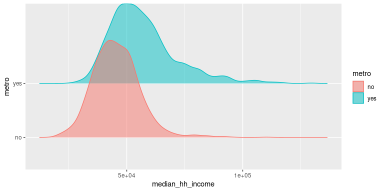
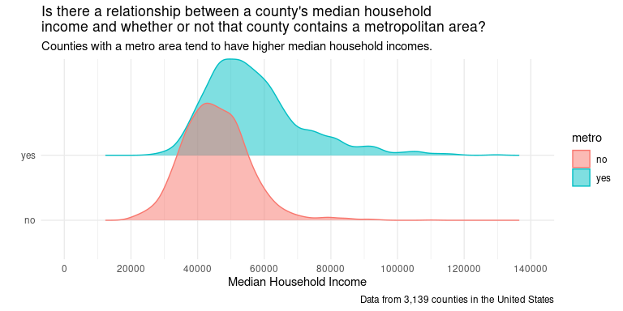

# KEY - Tutorial 4: EDA with Numerical Data
YOUR NAME

- [Before You Begin](#before-you-begin)
- [Up to this point, you’ve explored data that is either numerical or
  categorical. Here, you will expand the scope of questions you can
  explore by comparing numerical data across different
  groups.](#up-to-this-point-youve-explored-data-that-is-either-numerical-or-categorical-here-you-will-expand-the-scope-of-questions-you-can-explore-by-comparing-numerical-data-across-different-groups)
- [By the end of this tutorial, you should be able
  to…](#by-the-end-of-this-tutorial-you-should-be-able-to)
- [1: Load the libraries](#1-load-the-libraries)
- [2: Load and learn about the data](#2-load-and-learn-about-the-data)
  - [2.1: Tasks and Questions](#21-tasks-and-questions)
- [3: Ask statistical questions that lead you to explore numerical data
  across different
  groups](#3-ask-statistical-questions-that-lead-you-to-explore-numerical-data-across-different-groups)
  - [3.1: Tasks and Questions](#31-tasks-and-questions)
- [4: Build box plots and generate the supporting
  statistics](#4-build-box-plots-and-generate-the-supporting-statistics)
  - [4.1: Build the box plot](#41-build-the-box-plot)
    - [4.1: Tasks and Questions](#41-tasks-and-questions)
  - [4.2: Generate the statistics to support what’s shown in the box
    plot.](#42-generate-the-statistics-to-support-whats-shown-in-the-box-plot)
    - [4.2 Tasks and Questions](#42-tasks-and-questions)
  - [4.3 Answer your question and consider what you’re
    missing.](#43-answer-your-question-and-consider-what-youre-missing)
    - [4.3 Tasks and Questions.](#43-tasks-and-questions)
- [5. Build faceted histograms](#5-build-faceted-histograms)
  - [5.1a: Tasks and Questions](#51a-tasks-and-questions)
  - [5.1b: Tasks and Questions](#51b-tasks-and-questions)
- [6: Build a Ridge Plot](#6-build-a-ridge-plot)
  - [For this part of the tutorial, we will explore the
    question:](#for-this-part-of-the-tutorial-we-will-explore-the-question)
  - [6: Tasks and Questions](#6-tasks-and-questions)
- [7 - Bonus: Two Numerical Variables and a Categorical
  Variable](#7---bonus-two-numerical-variables-and-a-categorical-variable)
  - [For this part of the tutorial, we will explore the following
    question:](#for-this-part-of-the-tutorial-we-will-explore-the-following-question)
  - [7 - Bonus: Tasks and Questions](#7---bonus-tasks-and-questions)

## Before You Begin

Be sure to **read everything** as the structure of the tutorial is such
that everything builds upon the items that came before it.

<div style="color: black; background-color: white; padding: 15px; border: 5px solid #FF585D; border-radius: 5px;">

Any text highlighted in this red border will require you to either
**edit and run a code chunk or just run a code chunk**.

</div>

<div style="color: black; background-color: white; padding: 15px; border: 5px solid #006CB3; border-radius: 5px;">

Any text highlighted in this blue border will **require you to answer a
question**. You can type your response directly in the box with the blue
border.

</div>

## Up to this point, you’ve explored data that is either numerical or categorical. Here, you will expand the scope of questions you can explore by comparing numerical data across different groups.

Let’s get after it.

# By the end of this tutorial, you should be able to…

1.  Ask statistical questions that lead you to explore numerical data
    across different groups
2.  Build box plots and generate the supporting statistics
3.  Build faceted histograms.

# 1: Load the libraries

<div style="color: black; background-color: white; padding: 15px; border: 5px solid #FF585D; border-radius: 5px;">

As always, run the library code first.

</div>

``` r
library(tidyverse)
```

    ── Attaching core tidyverse packages ──────────────────────── tidyverse 2.0.0 ──
    ✔ dplyr     1.1.4     ✔ readr     2.1.5
    ✔ forcats   1.0.1     ✔ stringr   1.5.2
    ✔ ggplot2   4.0.0     ✔ tibble    3.3.0
    ✔ lubridate 1.9.4     ✔ tidyr     1.3.1
    ✔ purrr     1.1.0     
    ── Conflicts ────────────────────────────────────────── tidyverse_conflicts() ──
    ✖ dplyr::filter() masks stats::filter()
    ✖ dplyr::lag()    masks stats::lag()
    ℹ Use the conflicted package (<http://conflicted.r-lib.org/>) to force all conflicts to become errors

``` r
library(openintro)
```

    Loading required package: airports
    Loading required package: cherryblossom
    Loading required package: usdata

``` r
library(skimr)
library(ggridges)
library(knitr)
library(ggthemes)
```

# 2: Load and learn about the data

Throughout this tutorial, the data frame you will explore, named
*`county`*, is referenced in our textbook, [Introduction to Modern
Statistics](https://openintro-ims.netlify.app/index.html), and is
included in the `openintro` package.

## 2.1: Tasks and Questions

<div style="color: black; background-color: white; padding: 15px; border: 5px solid #FF585D; border-radius: 5px;">

1.  Run the code chunk below.

</div>

``` r
?county
glimpse(county)
```

    Rows: 3,142
    Columns: 15
    $ name              <chr> "Autauga County", "Baldwin County", "Barbour County"…
    $ state             <fct> Alabama, Alabama, Alabama, Alabama, Alabama, Alabama…
    $ pop2000           <dbl> 43671, 140415, 29038, 20826, 51024, 11714, 21399, 11…
    $ pop2010           <dbl> 54571, 182265, 27457, 22915, 57322, 10914, 20947, 11…
    $ pop2017           <int> 55504, 212628, 25270, 22668, 58013, 10309, 19825, 11…
    $ pop_change        <dbl> 1.48, 9.19, -6.22, 0.73, 0.68, -2.28, -2.69, -1.51, …
    $ poverty           <dbl> 13.7, 11.8, 27.2, 15.2, 15.6, 28.5, 24.4, 18.6, 18.8…
    $ homeownership     <dbl> 77.5, 76.7, 68.0, 82.9, 82.0, 76.9, 69.0, 70.7, 71.4…
    $ multi_unit        <dbl> 7.2, 22.6, 11.1, 6.6, 3.7, 9.9, 13.7, 14.3, 8.7, 4.3…
    $ unemployment_rate <dbl> 3.86, 3.99, 5.90, 4.39, 4.02, 4.93, 5.49, 4.93, 4.08…
    $ metro             <fct> yes, yes, no, yes, yes, no, no, yes, no, no, yes, no…
    $ median_edu        <fct> some_college, some_college, hs_diploma, hs_diploma, …
    $ per_capita_income <dbl> 27841.70, 27779.85, 17891.73, 20572.05, 21367.39, 15…
    $ median_hh_income  <int> 55317, 52562, 33368, 43404, 47412, 29655, 36326, 436…
    $ smoking_ban       <fct> none, none, partial, none, none, none, NA, NA, none,…

<div style="color: black; background-color: white; padding: 15px; border: 5px solid #006CB3; border-radius: 5px;">

2.  What is the name of the data frame?

    `county`

</div>

<div style="color: black; background-color: white; padding: 15px; border: 5px solid #006CB3; border-radius: 5px;">

3.  What are the observational units and how many are there?

    The observational units are counties in the United States. There are
    3,142.

</div>

<div style="color: black; background-color: white; padding: 15px; border: 5px solid #006CB3; border-radius: 5px;">

4.  How many numerical variables are there in this data frame?

    There are 10 numerical variables.

</div>

<div style="color: black; background-color: white; padding: 15px; border: 5px solid #006CB3; border-radius: 5px;">

5.  How many categorical variables are there in this data frame?

    There are 5 numerical variables.

</div>

# 3: Ask statistical questions that lead you to explore numerical data across different groups

As you know, questions appear at the top of our statistics wheel. You
then collect data, create visualizations, and generate statistics to
help you answer your questions. Being able to ask good statistical
questions is a key element to your work as a statistician and data
scientist. Like any skill, you need to practice to develop your
abilities! Let’s do that now.

## 3.1: Tasks and Questions

<div style="color: black; background-color: white; padding: 15px; border: 5px solid #006CB3; border-radius: 5px;">

1.  Write down a question that would require you to explore one
    numerical variable and one categorical variable from this dataset
    called `county`.

How does the poverty rate in counties that contain a metropolitan area
compare to those counties that do not have a metropoloitan area?

</div>

<div style="color: black; background-color: white; padding: 15px; border: 5px solid #006CB3; border-radius: 5px;">

2.  What is the name of each variable? Be sure to write each name
    EXACTLY as it appears in the data frame.

    numerical variable = poverty

    categorical variable = metro

</div>

<div style="color: black; background-color: white; padding: 15px; border: 5px solid #006CB3; border-radius: 5px;">

3.  Write down a second question that would require you to explore one
    numerical variable and one categorical variable.

    Is there an association between a county’s median education level
    and median household income?

</div>

<div style="color: black; background-color: white; padding: 15px; border: 5px solid #006CB3; border-radius: 5px;">

4.  What is the name of each variable? Be sure to write each name
    EXACTLY as it appears in the data frame.

    numerical variable = median_hh_income

    categorical variable = median_edu

</div>

<div style="color: black; background-color: white; padding: 15px; border: 5px solid #006CB3; border-radius: 5px;">

5.  Call Mr. Adams over to discuss the questions you just wrote
    questions.

</div>

# 4: Build box plots and generate the supporting statistics

Displaying multiple box plots is one way to construct a visualization to
compare numerical data distributions across different levels of a
categorical variable. In this section of the tutorial, you will begin to
explore the questions you asked above by creating a box plot for each
level of the categorical variable.

## 4.1: Build the box plot

As you work through the tasks and questions, you will reference **one**
of the questions you wrote in part 3.1.

### 4.1: Tasks and Questions

<div style="color: black; background-color: white; padding: 15px; border: 5px solid #FF585D; border-radius: 5px;">

1.  Replace `NAME_OF_DATA_FRAME`, `NUMERICAL_VARIABLE`,
    `CATEGORICAL_VARIABLE`.

    *\*\***Note:** The second line of this code tells the computer to
    filter or take out any cells that do not have a number. When a cell
    in your data frame is empty, it will automatically be filled with
    NA. The code you read there filters out any cell in the column of
    the variable you’ve defined that has NA in it)*

</div>

<div style="color: black; background-color: white; padding: 15px; border: 5px solid #FF585D; border-radius: 5px;">

2.  Run the code.

</div>

<div style="color: black; background-color: white; padding: 15px; border: 5px solid #FF585D; border-radius: 5px;">

3.  Add layers to this code to improve the title and labels on each axis
    and make it have the `theme_minimal`.

</div>

``` r
county |>
  filter(!is.na(poverty),!is.na(metro) ) |>
  ggplot(aes(x = poverty, y = metro, color = metro)) +
  geom_boxplot() +
  theme_minimal()
```


## 4.2: Generate the statistics to support what’s shown in the box plot.

Once again, we need to generate statistics to provide more information
about the visualization.

To do this, we need to use a few functions used to **wrangle our data**.

The three functions are:

- `filter`

- `group_by`

- `select`

**`filter`**: Think of this function like the options you have when you
are online shopping that allow you to narrow down the scope of products
you’d like to see. In this case, filter adjusts the number of rows in
your data frame. You do not always need to use this. We use it in this
case because we do not want to include any cells in our numerical
variable column that have an NA.

**`group_by`**: This function tells the computer to group all of the
observations that share the same level. Think of this as if you were
standing on the stage at all school and said, “Hi Everyone - right now I
want middle school students to group together and upper school students
to group together.” Once they are grouped together in the room, or in
this case the computer, can do things with each of those groups
separately.

**`select`**: This tells the computer, “Hey, I know you have a ton of
variables in this data frame, but I just want this/these specific
variable(s).” You can also select multiple variables by just listing
them with commas in between them.

### 4.2 Tasks and Questions

<div style="color: black; background-color: white; padding: 15px; border: 5px solid #FF585D; border-radius: 5px;">

1.  Replace `NAME_OF_DATA_FRAME`, `NUMERICAL_VARIABLE`,
    `CATEGORICAL_VARIABLE` to generate the statistics that support the
    box plots you made in the previous section.

</div>

<div style="color: black; background-color: white; padding: 15px; border: 5px solid #FF585D; border-radius: 5px;">

2.  Go back to second tutorial (2_EDA_Numerical_Data.qmd) and copy the
    `summarise` function, paste it below the line that has select, and
    edit it to fit this example.

</div>

<div style="color: black; background-color: white; padding: 15px; border: 5px solid #FF585D; border-radius: 5px;">

3.  Run the code.

</div>

``` r
county |>
  filter(!is.na(poverty), !is.na(metro)) |>
  group_by(metro) |>
  select(poverty) |>
    summarise(
    Mean = mean(poverty),
    Median = median(poverty),
    SD = sd(poverty),
    IQR = IQR(poverty),
    Q_one = quantile(poverty, 0.25),
    Q_three = quantile(poverty, 0.75),
    minimum_value = min(poverty),
    maximum_value = max(poverty)
  )
```

    Adding missing grouping variables: `metro`

    # A tibble: 2 × 9
      metro  Mean Median    SD   IQR Q_one Q_three minimum_value maximum_value
      <fct> <dbl>  <dbl> <dbl> <dbl> <dbl>   <dbl>         <dbl>         <dbl>
    1 no     17.0   16    6.88   9    11.9    20.9           2.6          52  
    2 yes    14.2   13.9  5.42   7.2  10.3    17.5           2.4          37.5

## 4.3 Answer your question and consider what you’re missing.

You’ve created a visualization and generated summary stats. Time to
start making sense of what they tell you.

### 4.3 Tasks and Questions.

<div style="color: black; background-color: white; padding: 15px; border: 5px solid #006CB3; border-radius: 5px;">

1.  Using information learned through your box plots and the statistics
    you generated, answer the question you asked. **\*\*\***Be sure to
    comment on and compare the **shapes, center, and variability** using
    **statistical vocabulary** and **relevant statistics** in your
    answer.

    While the distribution of poverty rates in counties that contain and
    do not contain a metropolitan area are both skewed to the right, the
    counties that have a metro area tend to have a lower poverty rate
    (median = 13.9) than counties without a metropolitan area (median =
    16). The counties without a metropolitan area also have a wider
    spread of poverty rates as the middle 50% of poverty rates in those
    counties falls from 11.9 to 20.9.

</div>

<div style="color: black; background-color: white; padding: 15px; border: 5px solid #006CB3; border-radius: 5px;">

2.  Despite learning information to help answer your questions, what
    information might you be missing from the visualization you created?
    In other words, what aspects of the distribution might not be easily
    seen in a box blot. List at least two pieces of information.

    Might either of these distributions be multi-modal?

    We also don’t get a sense of how many counties are in each group.

</div>

<div style="color: black; background-color: white; padding: 15px; border: 5px solid #006CB3; border-radius: 5px;">

3.  What is another visualization that could help you uncover those
    missing pieces of information?

    To see if the distributions is multi-modal and to compare the number
    of counties in each group, we can create a histogram for each
    distribution.

</div>

# 5. Build faceted histograms

Because you realized that the box plots might be hiding key insights,
you’ll want to pop up other visualizations that will help you see if
there is more insights to uncover in the data. Once you create both
visualizations, you can determine which one best communicates the story
in the data.

You will now create a **histogram for each level** of your categorical
variable and stack them above and below one another.

For this section, you will continue to **use the same variables you used
in part 4**.

## 5.1a: Tasks and Questions

<div style="color: black; background-color: white; padding: 15px; border: 5px solid #FF585D; border-radius: 5px;">

1.  Replace `NAME_OF_DATA_FRAME` and `NUMERICAL_VARIABLE` in the code
    chunk below question 5 in this section.

</div>

<div style="color: black; background-color: white; padding: 15px; border: 5px solid #FF585D; border-radius: 5px;">

2.  The last line of code (written in the code chunk below question 5 of
    this section) is going to do the stacking or **faceting**. You want
    to **facet it by the categorical** variable and then make the
    **number of rows** equal to the number of **levels for that
    categorical variable**. If you don’t know the number of levels use
    the code chunk below.

</div>

``` r
county |>
  filter(!is.na(metro)) |>
  select(metro) |>
  group_by(metro) |>
  count(metro)
```

    # A tibble: 2 × 2
    # Groups:   metro [2]
      metro     n
      <fct> <int>
    1 no     1974
    2 yes    1165

<div style="color: black; background-color: white; padding: 15px; border: 5px solid #FF585D; border-radius: 5px;">

3.  In the code chunk below question 5, change `CATEGORICAL_VARIABLE` ,
    `NUMBER_OF_LEVELS`, and `BIN_WIDTH`

</div>

<div style="color: black; background-color: white; padding: 15px; border: 5px solid #FF585D; border-radius: 5px;">

4.  Run the code.

</div>

<div style="color: black; background-color: white; padding: 15px; border: 5px solid #FF585D; border-radius: 5px;">

5.  Add layers to this code to improve the title and labels on each axis
    and make it have the theme_minimal.

</div>

``` r
county |>
  filter(!is.na(poverty) & !is.na(metro)) |>
  ggplot(aes(x = poverty)) +
  geom_histogram(binwidth = 2.5) +
  facet_wrap(~metro, nrow = 2)
```


## 5.1b: Tasks and Questions

<div style="color: black; background-color: white; padding: 15px; border: 5px solid #006CB3; border-radius: 5px;">

1.  Did you learn anything new about the distributions by looking at the
    visualizations you just created? If so, explain.

    I learned that there are more counties that do not have metropolitan
    areas.

</div>

<div style="color: black; background-color: white; padding: 15px; border: 5px solid #006CB3; border-radius: 5px;">

2.  What is one new statistical question that you’d want to explore
    based on what you learned through the faceted histogram?

    Why might counties without metropolitan areas tend to have higher
    poverty rates?

</div>

<div style="color: black; background-color: white; padding: 15px; border: 5px solid #006CB3; border-radius: 5px;">

3.  Call Mr. Adams over to chat through your work on the tutorial thus
    far.

</div>

# 6: Build a Ridge Plot

A ridge plot is one more way to visualize distributions across different
groups.

## For this part of the tutorial, we will explore the question:

**Is there a relationship between a county’s median household income and
whether or not that county contains a metropolitan area?**

## 6: Tasks and Questions

<div style="color: black; background-color: white; padding: 15px; border: 5px solid #006CB3; border-radius: 5px;">

1.  Which variables would we need to use to explore that question? Type
    the names of the variables EXACTLY as they appear in the data frame
    into the code chunk below.

`median_hh_income`

`metro`

</div>

<div style="color: black; background-color: white; padding: 15px; border: 5px solid #FF585D; border-radius: 5px;">

2.  Add in a row that filters out any `NA` values for the numerical
    variable.

</div>

<div style="color: black; background-color: white; padding: 15px; border: 5px solid #FF585D; border-radius: 5px;">

3.  Run the code.

</div>

``` r
county |>
  filter(!is.na(metro) & !is.na(median_hh_income)) |>
  ggplot(aes(x = median_hh_income, 
             y = metro, 
             color = metro, 
             fill = metro)) +
  geom_density_ridges(alpha = 0.5)
```

    Picking joint bandwidth of 2270



``` r
county |>
  filter(!is.na(metro) & !is.na(median_hh_income)) |>
  ggplot(aes(x = median_hh_income, 
             y = metro, 
             color = metro, 
             fill = metro)) +
  geom_density_ridges(alpha = 0.5) +
  labs(x = "Median Household Income", 
       y = "", 
       title = "Is there a relationship between a county's median household\nincome and whether or not that county contains a metropolitan area?", 
       subtitle = "Counties with a metro area tend to have higher median household incomes.",
       caption = "Data from 3,139 counties in the United States") +
  scale_x_continuous(limits = c(0, 140000), breaks = seq(0, 140000, 20000)) +
theme_minimal()
```

    Picking joint bandwidth of 2270



What’s going on with the scales?

What can you do about that?

The next few questions will help you adjust the scales.

<div style="color: black; background-color: white; padding: 15px; border: 5px solid #FF585D; border-radius: 5px;">

5.  You can learn more about what may be going on with the scales by
    generating the statistics to support the ridge plot. Understanding
    the statistics can then help you get a sense of how you should
    adjust your axes. Run the code below to do just that.

</div>

``` r
county |>
  filter(!is.na(median_hh_income)) |>
  group_by(metro) |>
  select(median_hh_income) |>
    summarise(
    Mean = mean(median_hh_income),
    Median = median(median_hh_income),
    SD = sd(median_hh_income),
    IQR = IQR(median_hh_income),
    Q_one = quantile(median_hh_income, 0.25),
    Q_three = quantile(median_hh_income, 0.75),
    minimum_value = min(median_hh_income),
    maximum_value = max(median_hh_income)
  )
```

    Adding missing grouping variables: `metro`

    # A tibble: 3 × 9
      metro   Mean Median     SD    IQR  Q_one Q_three minimum_value maximum_value
      <fct>  <dbl>  <dbl>  <dbl>  <dbl>  <dbl>   <dbl>         <int>         <int>
    1 no    45544.  44892 10104. 12658. 38761.   51419         19264        110190
    2 yes   56908.  54150 14557. 16387  46784    63171         26346        129588
    3 <NA>  61750   61750    NA      0  61750    61750         61750         61750

<div style="color: black; background-color: white; padding: 15px; border: 5px solid #FF585D; border-radius: 5px;">

6.  Now that you have the summary statistics, go back up to the code you
    wrote to generate the ridge plot and define the scale for the
    x-axis. Once changed, run the code again.

</div>

<div style="color: black; background-color: white; padding: 15px; border: 5px solid #FF585D; border-radius: 5px;">

7.  Add layers to this code to improve the labels title and labels on
    each axis. Also add layers to the plat that make the theme
    `theme_minimal`, the color `scale_color_colorblind()`, and the fill
    `scale_fill_colorblind()`.

</div>

<div style="color: black; background-color: white; padding: 15px; border: 5px solid #006CB3; border-radius: 5px;">

8.  Describe the distributions you just created. Be sure to comment on
    and compare the shape, center, and variability of the distributions.

Counties with metro areas tend to have higher median household incomes
(median = \$54,150) than those counties without a metro area ((median =
\$44,892). The counties with metro areas also have a wider range in
median incomes, which is evident from the middle 50% of median incomes
raning from 46,784 to 63,63,171. There are a few counties with metro
areas that have particularly high median incomes which makes the
distribution have a shape that is skewed to the right. On the other
hand, distribution of median household incomes the counties without a
metro area are more symmetrical around the mean (45,5544.11) and tend to
fall roughly within 10,104.41 of that mean.

</div>

# 7 - Bonus: Two Numerical Variables and a Categorical Variable

## For this part of the tutorial, we will explore the following question:

**Is there an association between the homeownership rate, poverty rate,
and whether the county contains a metropolitan area?**

## 7 - Bonus: Tasks and Questions

<div style="color: black; background-color: white; padding: 15px; border: 5px solid #006CB3; border-radius: 5px;">

1.  What are the three variables we will need to explore this question?
    Label the variable that is the response variable. Type the names
    EXACTLY as they appear in the county data frame.

</div>

<div style="color: black; background-color: white; padding: 15px; border: 5px solid #FF585D; border-radius: 5px;">

2.  Replace `NAME_OF_DATA_FRAME`, `CATEGORICAL_VARIABLE`,
    `NUMERICAL_VARIABLE_X`, `NUMERICAL_VARIABLE_RESPONSE` with the
    appropriate variable names. (Hint: You will want home ownership on
    the y-axis)

</div>

``` r
county |>
  filter(!is.na(metro)) |>
  ggplot(aes(x = poverty, y = homeownership, color = metro)) +
  geom_point(alpha = 0.25) +
  geom_smooth(method = lm) +
  theme_minimal()
```

    `geom_smooth()` using formula = 'y ~ x'


<div style="color: black; background-color: white; padding: 15px; border: 5px solid #FF585D; border-radius: 5px;">

3.  Run the code.

</div>

<div style="color: black; background-color: white; padding: 15px; border: 5px solid #006CB3; border-radius: 5px;">

4.  Looking at the visualization you created, answer the following:

What do you notice? Answers may very.

- I notice that the dots are closed together.

- I notice there are now two different color dots, one for counties with
  metro areas and one for counties without.

- According to the lines, it looks like the rate of homeownership goes
  down more slowly as poverty rates increase in counties without a metro
  area compared to those with a metro area.

- The strength of the associates are fairly strong.

- The direction of the association between poverty and homeownership is
  negative.

What do you wonder?

- I wonder why this associate is the case.

- I wonder what the equation of each of those lines is.

- I wonder why the lines cross.

- I wonder what the shaeded area around the line is.

</div>

<div style="color: black; background-color: white; padding: 15px; border: 5px solid #006CB3; border-radius: 5px;">

5.  You’ve now **crushed 4 challenging coding tutorials** and are well
    on your way to being a pro! Turn on your favorite pump up song,
    **turn up the volume on your computer**, and pat yourself on the
    back!

</div>
